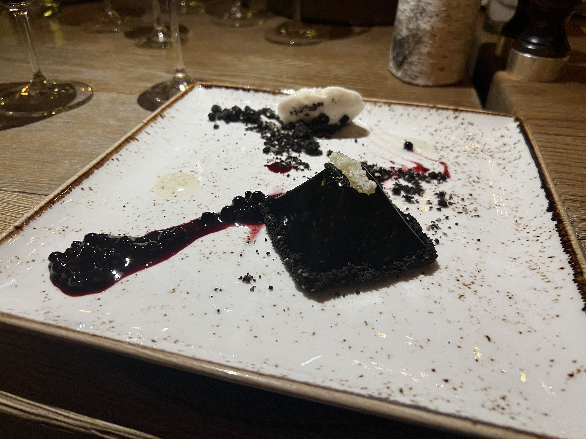

This was honestly an experience I never expected to have - eating a Michelin-starred chef's six-course menu at a fancy ski resort in the middle of the mountains. Nonetheless, I was lucky enough to have been able to be at the right place at the right time.

And all I can say is, the food was phenomenal.

The first course was called _AB Carpaccio_, I assume "AB" for Akira Back. This was no typical carpaccio, however - it consisted of flat circles of bigeye tuna seasoned with shavings of truffle, paired with crunchy chips(?) and topped with an umami sauce. I really liked it - usually I'm not too big of a fan of tuna since it gets a little fishy, but this was absolutely immaculate. The texture contrasts and the flavor profiles were some of the best I've ever tasted.

    

The next course was a _Sous Vide Lobster_, topped with caviar (!!!) and a seaweed butter sauce called Nori Beurre Blanc. This was also pretty fantastic (I'm always a fan of lobster), although it was just a _tad_ bit rich for my personal taste, but still lovely.

    

Third in line was the _Duck "Three Ways"_, consisted of duck breast, terrine, and shaved foie gras, and paired with fried leeks and a "farroto" made of shimeji and shiitake mushrooms. I really liked the farroto - it looked slightly bizarre but tasted delightful.

    

Next we got the _Gochujang Miso Chilean Sea Bass_, which, based on the name of the dish, I was the _most_ excited for (I like gochujang, miso, and sea bass, what more could I ask for)? To start, the presentation was definitely a work of art in itself. I have to say that the three preceding dishes set the bar ridiculously high and I was actually a slight bit underwhelmed by this dish, but also because I'm personally not a fan of some of the ingredients - cauliflower puree, english pea, cilantro oil. I also thought the dried peach bits were a bit of a weird pairing to the fish. (I still enjoyed it though.)

    

Our last main course was the _Grilled Montana Reminisce Ranch Filet Mignon_ (these names just get longer and longer). Topped with wasabi-sea urchin butter, wakame, and pickled cucumber, I love love _loved_ this dish. The medium rare steak was more raw than I am usually comfortable with (I know, don't dunk on me) but for this particular preparation, it was the perfect amount of juicy and tender. I'm generally not a fan of uni, but the sea urchin butter was not overpowering and added a nice amount of depth of flavor.

    

Finally, last but not least, was the dessert course, the _Valentine's Valrhona Chocolate Mousse Pyramid_. It was, as you can imagine, a chocolate mousse pyramid filled with yuzu creme brulee and huckleberry, surrounded by a dark chocolate-sesame streusel, and accompanied with a Tahitian vanilla bean sorbet. Lots of stuff. I don't have that much of a sweet tooth and was also massively full at this point so I don't think I enjoyed it as much as I should have, but nonetheless - beautiful presentation as always.

    

Every dish was fantastic, but if I really had to rank them, I think it would've been:

1. Carpaccio
2. Filet Mignon
3. Duck
4. Lobster
5. Sea Bass
6. Chocolate

Anyways, this wasn't even a restaurant so I can't tell y'all to go check it out... but Chef Akira Back is amazing and go visit one of his [insert some large number] restaurants around the world - it will definitely not disappoint, you have my word.

_tags: chef akira back, spanish peaks resort, montana_
