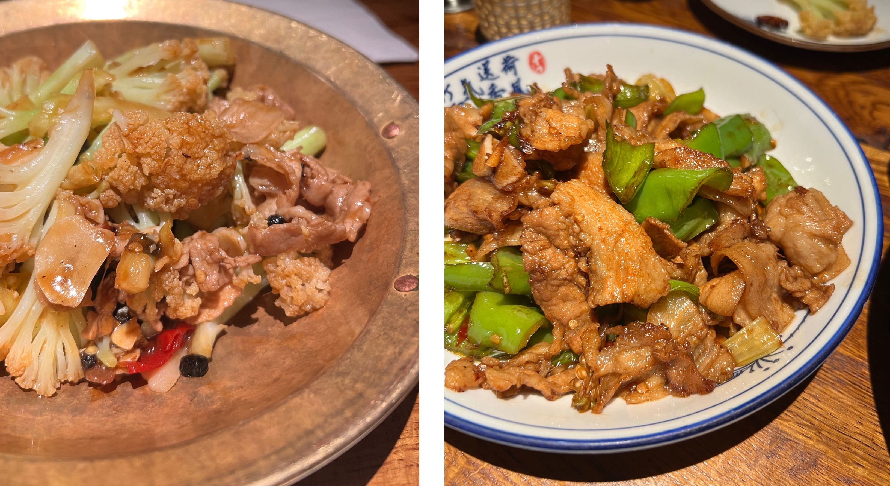
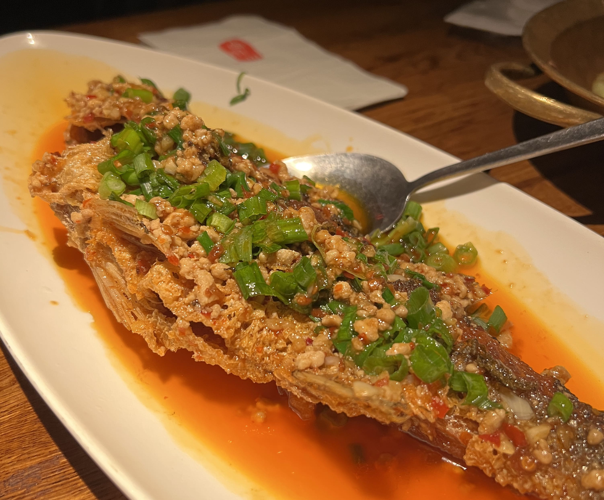

Szechuan Mountain House (Manhattan location rebranded as just 'Mountain House' now) has been one of my go-to favorites for Sichuan food in the city. It's also located conveniently in the heart of St. Marks Place, with a wide variety of after-dinner dessert shops nearby. If you go during peak hours there's definitely going to be a wait here, but this time I showed up at around 4:30 PM and there were plenty of seats available! 

I didn't manage to get photos of the interior (although you can probably find it on Google maps) but the inside of the restaurant is actually incredible. There's these red lanterns hanging from the ceiling, and all the decor is wood and gives a very classical Chinese ambience to the entire restaurant. Definitely creates a mood for your dinner (or lunch)!

It was actually a bizarre day because most of the dishes I'd ordered before were somehow not available that day (they were missing some vegetable ingredients from the kitchen or something) so my friend and I decided to venture out of our comfort zones and order some things we've never tried. Lo and behold - these new dishes were fantastic. (And now for the next time I go, I have so many more options that are tried-and-true!)

    

 

The stir-fried cauliflower was actually the best cauliflower I've had - I didn't know cauliflower could absorb so much flavor! The crunch paired with the soft pork belly simply blew me out of the water.

The green pepper pork was also amazing. Visually, it looks pretty unassuming as a dish, but the pork was marinated just the right amount - not too salty and not too bland, and the cuts weren't too fatty nor too lean.

Lastly, we got a whole fish just for kicks.

    

 

It was a bit of a struggle for us to eat, with all the fish bones and whatnot, although that's only from our inexperience and definitely not the restaurant's fault. The parts that we _were_ able to eat were really tasty, and the fish skin was delightfully crispy and umami from the sauce and seasoning. 

Conclusion: Szechuan Mountain House never ceases to disappoint. Definitely visit for the food, but also for the ambience too!

_tags: location/nyc, szechuan mountain house, sichuan cuisine, chinese food, st marks_

