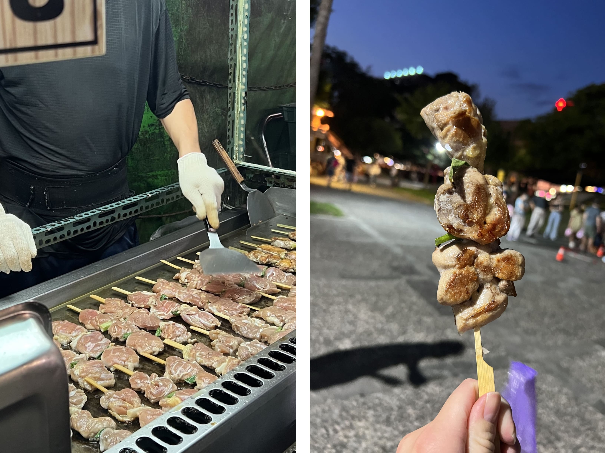
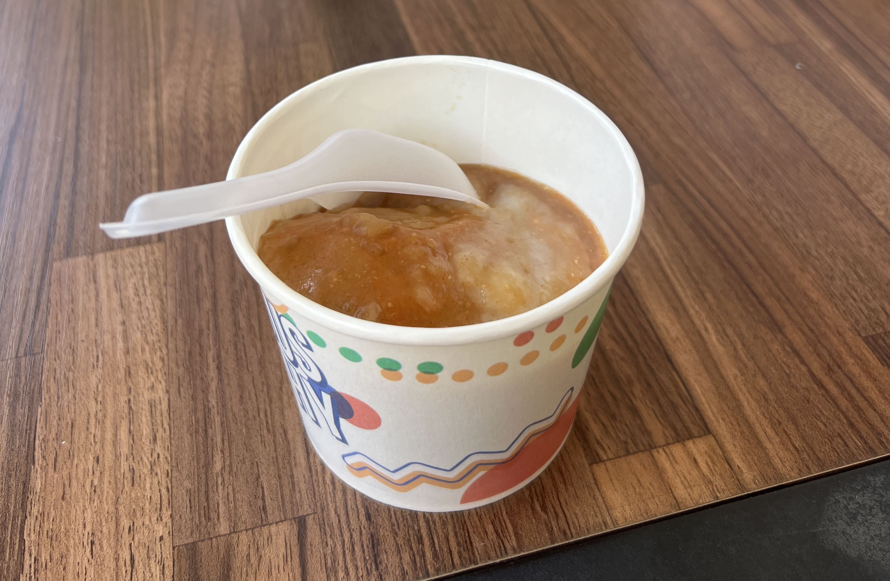
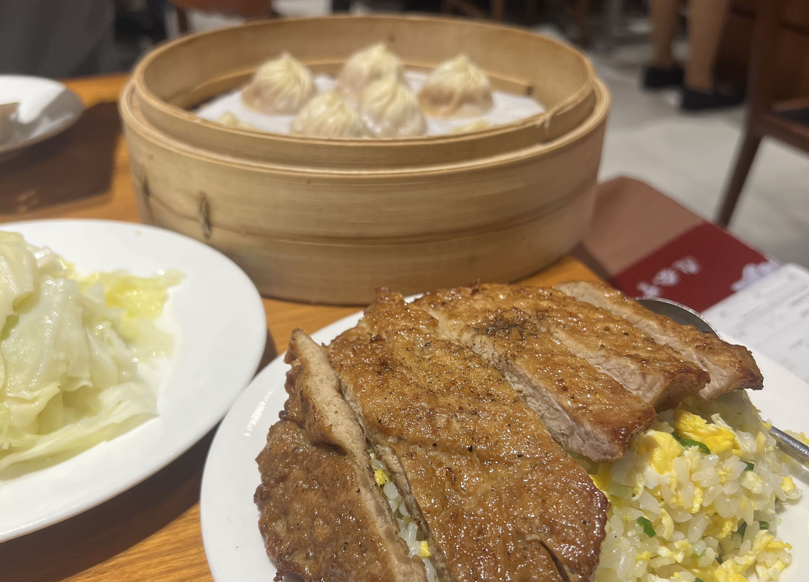
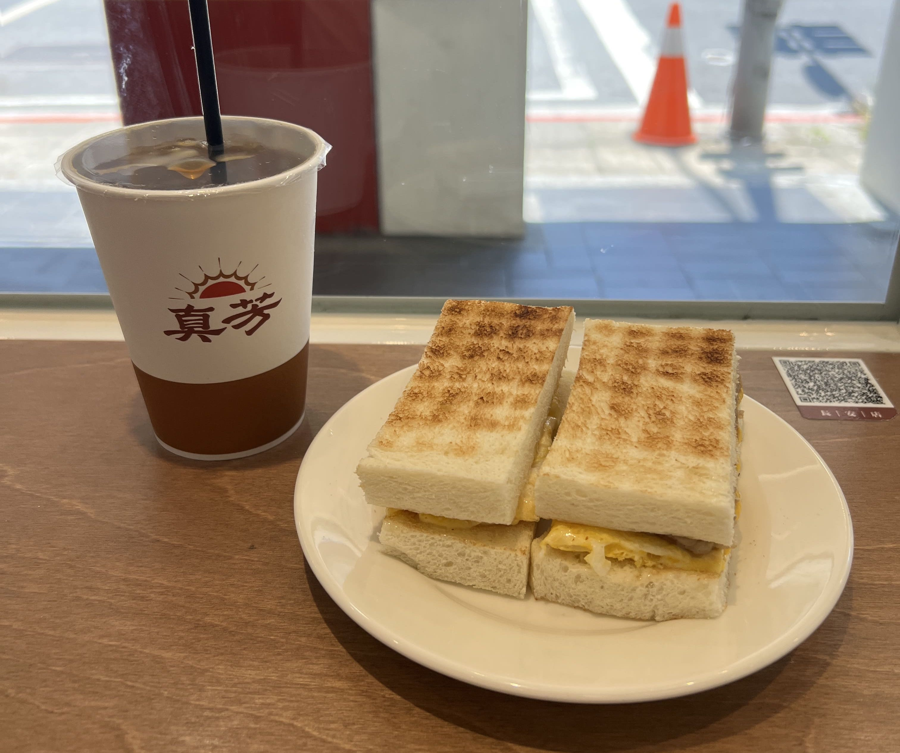

After a while I realized I couldn't feasibly make a blog post for every single place I went to in Taiwan (well... in theory... I could... but then you might still be hearing about my Taiwan trip halfway through 2023...) so here is a collection of my top places to visit (mostly in terms of food and shopping). If you're visiting, let me know if you try any of these!

<h3>food top 5</h3>

[1] Luodong Night Market 羅東夜市 - chicken thigh skewers

    

 
Some might say nightmarkets are kind of overrated, but I beg to differ. This chicken thigh skewer at Luodong Night Market was honestly probably the most memorable thing I ate in Taiwan those whole 2 months. The line for it was quite long, and for good reason. The juiciness of the chicken thigh combined with the aromatic seasoning made for the perfect late-night snack. 
  
[2] Mao Yan Rou Yuan 茂焱肉圓 in Yuanli, Miaoli County
  

    

 
This is not even in Taipei, but if you find yourself in Miaoli County, this 肉圓 (Taiwanese meatball, ròu yuán in Mandarin, ba wan in Hokkien) is a must-must-MUST try. This particular ba wan stand has been here for over 60 years, and is the most famous ba wan place in all of Yuanli. It may just look like a nondescript old food stand if you're passing by, but don't be fooled! 
  
[3] Din Tai Fung 鼎泰豐
  

    

 
I considered not including DTF in this list because it's so basic, but honestly, it's a classic. The soup dumplings never disappoint, the pork chop fried rice never disappoints. And DTF in Taiwan is SO much better than the ones in States. 
  
[4] Chamonix 夏慕尼
  

    

 
If you haven't read my blog post on Chamonix, <a href="https://clarityeats.com/chamonix/" target="_blank">here</a> it is. Tldr; the Grilled Short Ribs with Garlic is to DIE for.
  
[5] Zhen Fang 真芳
  

    

 
This unassuming breakfast chain in Taipei quickly became my go-to for breakfast sandwiches. Their toast is SO soft and fluffy, and I honestly never knew pork-egg-cheese sandwiches could be so mouth-watering. They also have really good milk tea.
  

My two-month trip to Taipei can't be summarized with just food, however. I spent a rather nontrivial amount of time shopping, because, well, it's Taipei.

If you're looking to revamp your wardrobe or buy souvenirs for friends and family back home, here were some of my favorite places to spend money:

[1] Ximending 西門町 - Iconic shopping district where young adults congregate. Lots of clothing and skincare and jewelry stores, street performances, and some food as well. Beware of the various aggressive salespeople that approach you in the street: if you talk to them, you might end up spending 3000 NTD on some random bottle of sunscreen. 

[2] Eslite Xinyi 信義誠品 - Flagship Eslite store. Lots of artisanal shops inside a massive bookstore, mixed in with stationery, jewelry, phone cases, home goods, fragrances, clothing, and pretty much anything you'd want to buy or look at. Also has a food court! Honestly pretty expensive, but worth visiting anyways.

[3] The streets north of Zhongxiao Dunhua 忠孝敦化 MRT station - if you exit the station and head north, you'll know what I'm talking about. An array of various clothing and jewelry stores, nightmarket style, surprisingly inexpensive considering it's in the heart of 東區 (Taipei's upscale East District). Anything from shoes to street fashion to boba places - it'll be there. 

[4] Shida Night Market 師大夜市, Gongguan Night Market 公館夜市 - two of my favorite night markets to shop at in Taipei. Inexpensive clothing, quality not _too_ sus, and lots of cute jewelry stores as well. Also - good food :)

[5] Charles & Keith - luxury leather brand from Singapore, lots of branches all across Taipei. Price point around $60-80 USD per bag, also has very good quality shoes!

[6] RobinMay - Taiwan-based luxury leather brand, price point around 60-80$ per bag, lots of styles available.

So these are my favorites. There are seriously way too many good places to eat and shop in Taiwan, so if you're planning a trip and can't decide what to do, perhaps this helps narrow down your list a little!

台灣,下次見~
 

_tags: location/taiwan, night markets, shopping_

