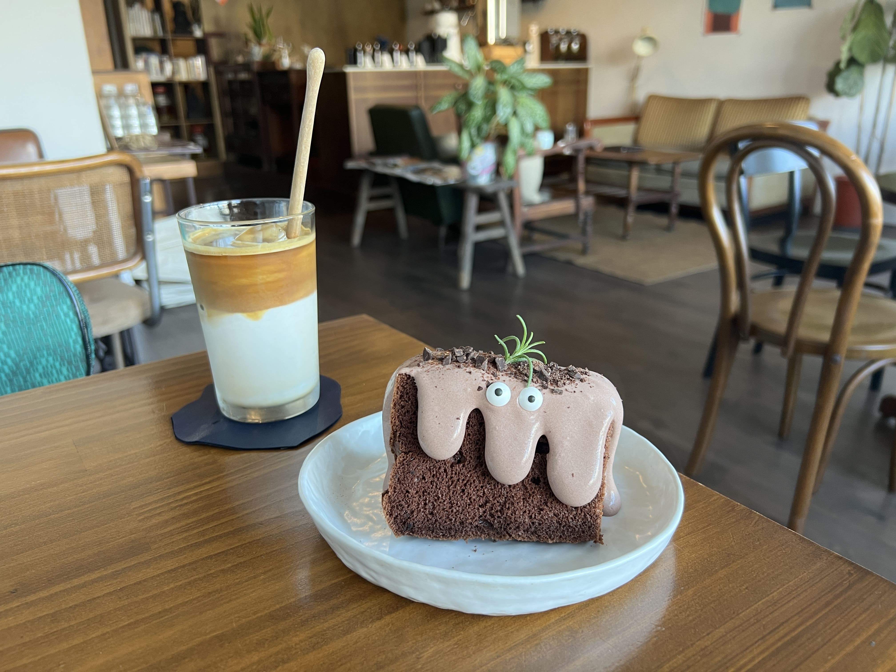
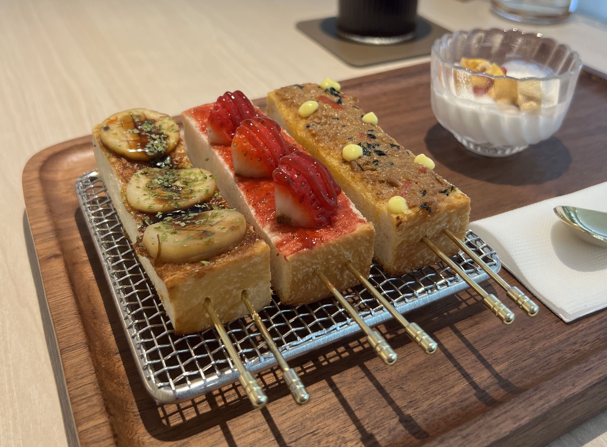
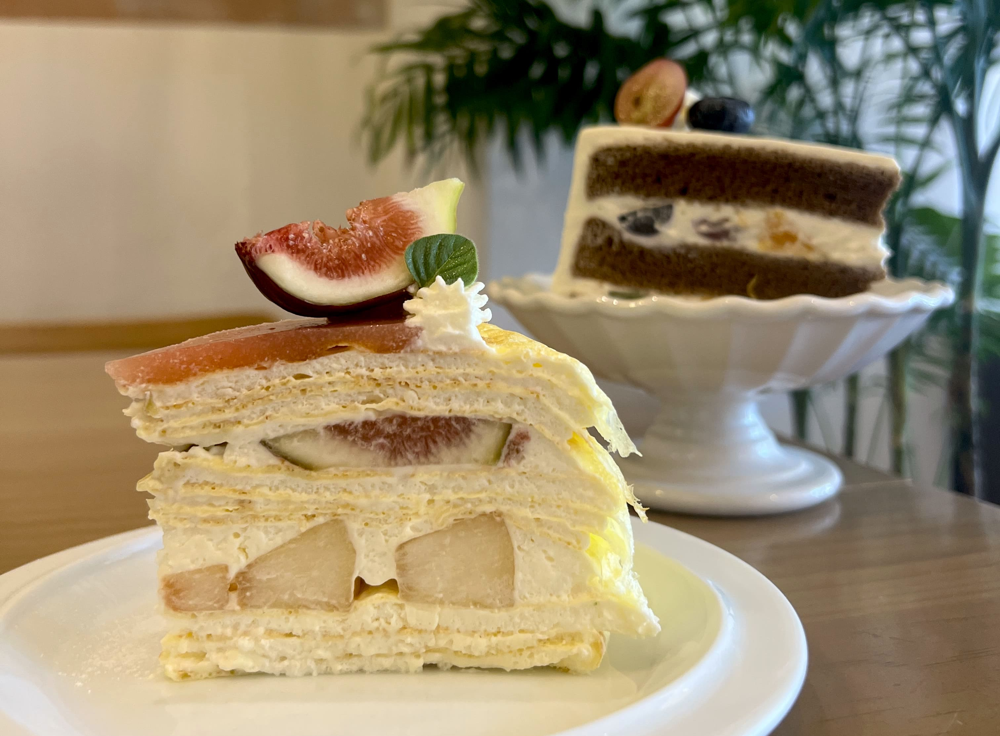
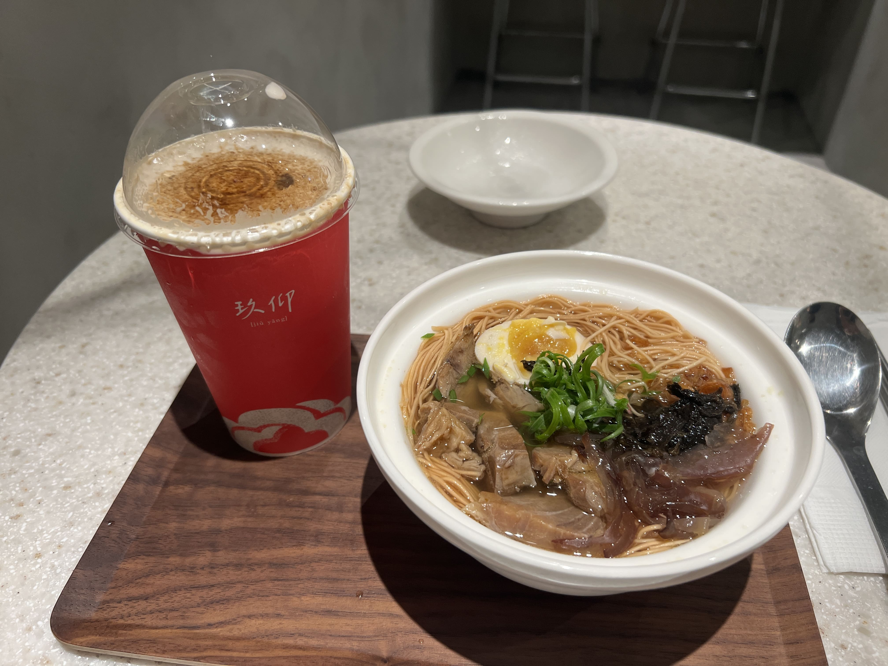
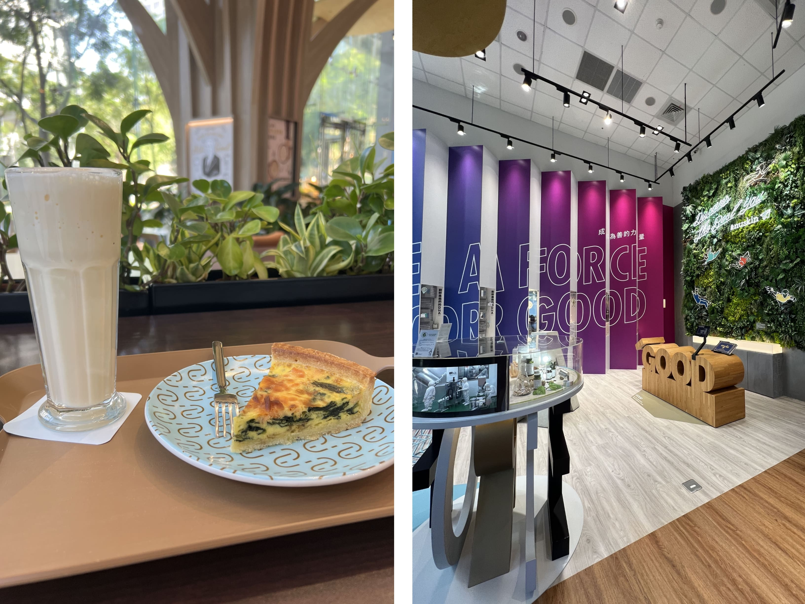
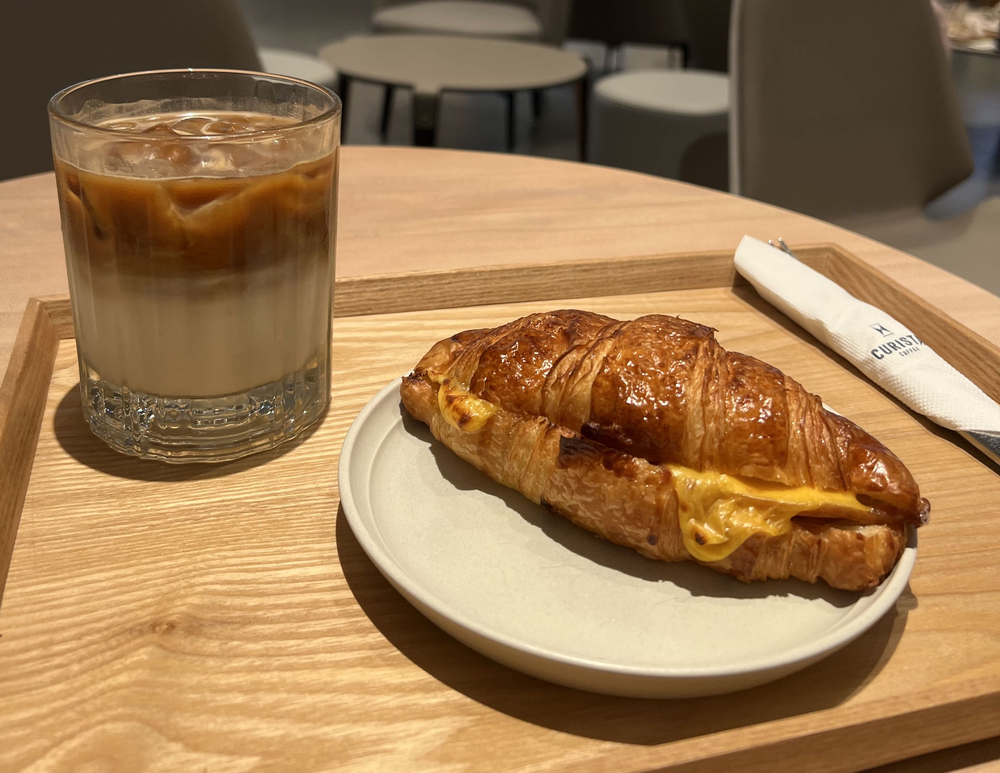

Near the end of my stay in Taiwan I decided to go cafe-hunting to find the most aesthetic in cafe in Taipei. It ended up proving quite a difficult task to choose the first place winner, so I'll let you decide out of my favorites...
 
 

    

<h3>point 2 coffee studio 點二咖啡</h3>
10491, Taiwan, Taipei City, Zhongshan District, Minzu E Rd, 208號2樓

• pros: the most ~ adorable ~ chocolate chiffon cake, and a really hyperactive puppy inside the cafe that you can play with :) 

• cons: besides the cake there isn't that much else to order. location is kind of an awkward place to get to unless you live on or close to the yellow mrt line
 
 

    

<h3>blivin bakery 植物系生吐司専門店</h3>
106, Taiwan, Taipei City, Da’an District, Lane 252, Section 1, Dunhua S Rd, 5號1樓

• pros: everything from the cafe exterior to the interior to the food is aesthetic. delicious shokupan (japanese milk bread), excellent customer service (they gave me free bread samples!), really convenient location (near zhongxiao dunhua mrt station)

• cons: on the pricier side (drinks cost almost as much as the food...)
  

    

<h3>guoguo 果果</h3>
106, Taiwan, Taipei City, Da'an District, Rui'an St, 202號

• pros: _very_ beautiful cakes, mille crepe cake texture on point, fresh fruits were actually so good

• cons: interior feels a bit cramped and dark (photos on google looked better than irl), cake slices are rather expensive, location a bit hard to get to from mrt
  

    

<h3>jiuyang 玖仰</h3>
106, Taiwan, Taipei City, Da'an District, Yongkang St, 9-1號

• pros: so many options of food and drinks and dessert. super inexpensive, spacious interior, food exceeded expectations

• cons: i wished the drink came in some sort of aesthetic container rather than just a paper cup :<
  

    

<h3>nu cafe</h3>
110, Taiwan, Taipei City, Xinyi District, Section 4, Zhongxiao E Rd, 557號1樓

• pros: very forest vibes, almost feels like a museum inside. super quiet and ambient

• cons: not many food options at all, also a bit expensive, the smoothie i got was kinda mid
  

    

<h3>curista coffee 奎士咖啡 </h3>
110, Taiwan, Taipei City, Xinyi District, Section 4, Zhongxiao E Rd, 563號一樓

• pros: super spacious interior, very comfortable (i almost fell asleep on the couch)

• cons: could either be a pro or a con but it basically felt like an asian starbucks, nothing too special

  
So these are my top six!! To be completely honest unless the food is really bad or customer service is rude I often have trouble writing criticism for places since I personally always try to focus on the good parts of every experience. However, as a food blogger criticism is often as important as praise, so these pros vs. cons are my attempt at remediating the situation (haha). Hope you find this helpful, and let me know if you hit up any of these cafes!

_tags: location/taiwan, cafes, aesthetic, desserts, coffee_

