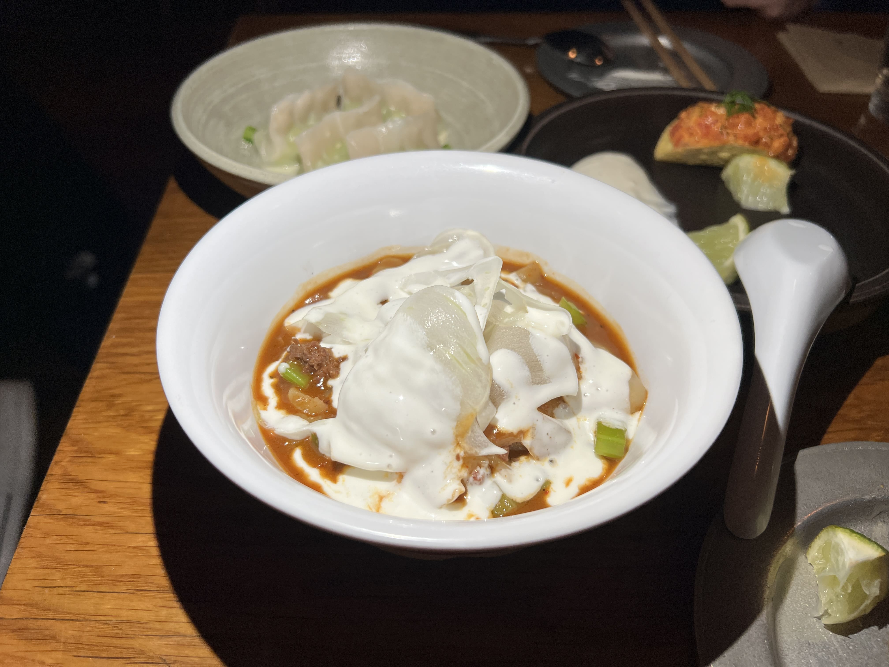

First post of the year! It's been a pretty busy January but I managed to visit a restaurant that's been on my go-to list for years - Thursday Kitchen! The wait is always insane and they don't take reservations, but on this day it was raining so hard that we were able to be seated immediately. (Genius planning, what can I say?)

Thursday Kitchen is a Korean fusion restaurant with French and Spanish influences, buried a couple blocks down from the bustling St. Marks. The dishes are tapas style and are definitely pretty small in portion-size, so they recommend each person to get around 3 plates.

The menu is actually rather compact, but everything looked so good that it was hard to narrow down the choices. We ended up deciding on five dishes, although if I had a way larger stomach I could've ordered the whole menu.

    

I had sort of expected the 'ugly potato' to be sort of like fries or potato wedges, and it ended up being more like fried chunks of potato seasoned with an umami sauce and feta cheese. The crispy skin and the soft flesh of the potato mixed with the salty and tangy toppings made for a very intriguing yet also comforting appetizer. (Totally recommend.)

    

The next dish to arrive was the tuna tartare tacos. They not only sounded, looked, but also tasted top-notch. The little bite-size crunchy tacos were packed to the brim with juicy, well-marinated tuna chunks, and a squeeze of lime juice over the top made them absolutely impossible to get enough of. (Yes, this was probably my favorite dish of the day.)

    

Taking an enthusiastic recommendation from the solitary diner sitting at the table next to us, we ordered the edamame dumplings. I'm just going to say that the handiwork on these dumplings is absolutely beautiful, and the plate and everything just made this dish look like its own little piece of art. Personally I didn't like the dumplings as much as the recommender did (I think I like my dumpling fillings to be a little bit more strongly flavored) but it was definitely a very unique concept for sure.

    

The lucky noodle was actually the dish I had the highest expectations for, since I am a huge fan of spicy hand-ripped noodles. I kind of imagined it'd be like Biang Biang mian so I think it ended up being slightly underwhelming because it wasn't (and also I don't like fennel so it was a pain avoiding all the fennel underneath the yogurt but that's my own issue), but the flavor of the noodles was still very tasty and it was certainly an interesting twist on a very common dish.

    

Finally, last but not least, we ordered the steak, also an enthusiastic recommendation from our friend next door. Although the presentation looked pretty run-of-the-mill, the meat was actually melt-in-your-mouth hands-down spectacular. It was cooked to medium rare perfection, and the sauces and everything just made it one of the best steaks I've ever had. (Thanks enthusiastic recommender!)

I think the older I get the less crazy I am about fancy-ish restaurants since they often have all these weird ingredients and tiny portions and cost $$$$$$$, but I think Thursday Kitchen strikes a very good balance between comfort food and elevated fusion, and isn't even that ridiculous in terms of their prices. Most importantly, the creativity of the dishes doesn't take away from the taste - so huge kudos to the chefs. I would definitely go again, as long as the wait isn't too long. All in all it's definitely a must-try, and if you want to avoid the wait, go on a day with absolutely shitty weather. :)

_tags: location/nyc, thursday kitchen, korean fusion, st marks place_
