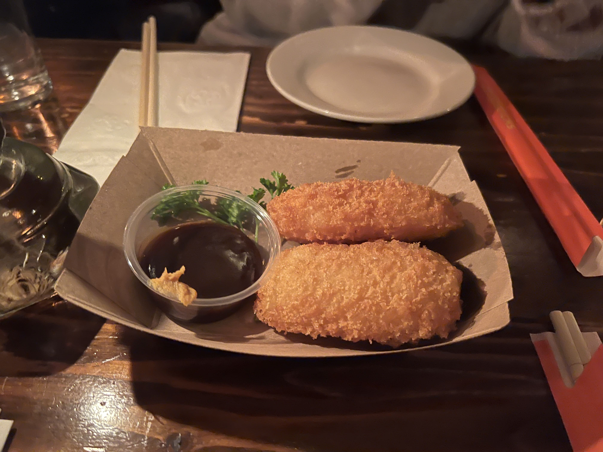
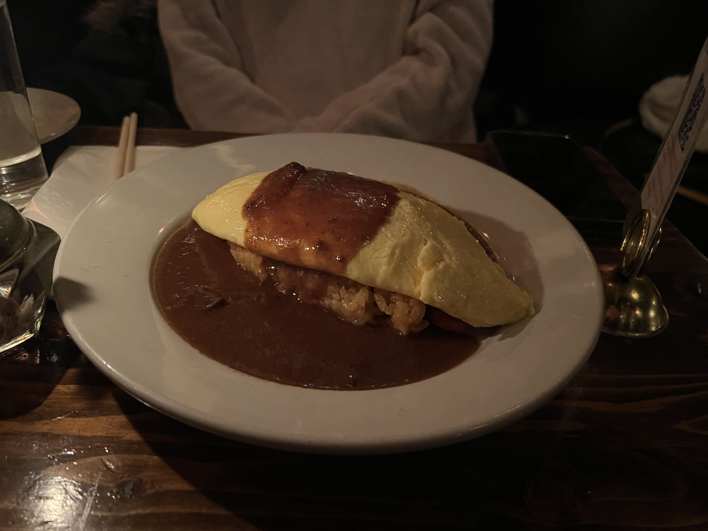
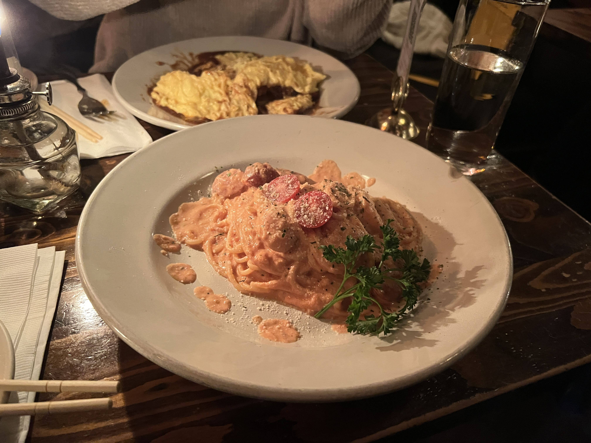

It might be a lesser known fact that the Turtle Bay area of Manhattan, NYC is somewhat of a "Japantown" - yes, the same area I discovered Izakaya Toribar of the previous post. Numerous izakayas, yakiniku, and omakase places decorate the area, a mix of modern and authentic, traditional and fusion.

If you happen to venture onto East 53rd Street, in between 2nd and 3rd Ave, you might be taken aback by a long line , split into sections, like some sort of dreadful gigantic Godzilla-version milk snake. You might think there's some kind of concert happening here, or maybe a hidden club. Well, you're not entirely wrong.

Tomi Jazz is a Japanese jazz club, serving izakaya-style food next to a live jazz band. Even on weekday nights, the line out the door starts forming before they open at 5pm, and during peak weekend hours, the wait can be up to 4 hours long.

Their menu ranges from Japanese-Italian food to omurice and okonomiyaki, items that are a little harder to find in NYC. There's also an extensive range of cocktails, both Western and Japanese style, and a dessert section.

We got crab cream croquettes for our appetizer. It was delicious, two was definitely not enough.

    

For mains, my friend got the omelet rice with demi-glace, and the presentation was beautifully done. Nothing too out-of-the-ordinary here, but it was very delicious all the same.

    

I got the tomato cream spaghetti, since I had been craving Japanese Italian food for weeks. (Why is it so hard to find in NYC? Besides Davelle and Hi-Collar, I have yet to find other places that serve a good Napolitan.) It was amazing, would highly recommend!

    

Since it is a jazz club, there's a music cover charge ($10) for all patrons. They also ask for tips for the musicians, although it is not required. I will caveat: it's also relatively loud once they start playing - if you are looking for a quiet place to have a relaxing dinner conversation, this is probably not the place to go. (We found ourselves raising our voices on numerous occasions to be heard.) It is also very dark inside, so not a place for aesthetic foodie Instagram pics. It is also _very_ crowded, so be prepared to be squeezing into your seat at the bar!

Nonetheless, if you're looking for a unique dinner experience with live music and delicious food, Tomi Jazz is a one-of-a-kind experience. Just make sure to get there early, so you don't end up waiting 3 hours in line.

_tags: location/nyc, japanese cuisine, izakaya_
