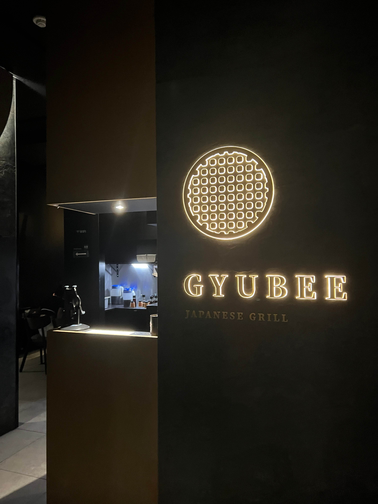

After Vancouver <a href="https://clarityeats.com/vancouverDay1/">last summer</a>, I was eager to explore more of Canada - this time on the East Coast!

My friend and I arrived late at night at the Buffalo Niagara Int'l Airport, ubered to the start of the Rainbow Bridge, and trekked across into Niagara Falls, ON. We were confused on the etymology until we reached the halfway mark, where the American Falls became visible:

    

Probably one of the coolest things I've seen, tbh.

We stayed at the Crowne Plaza, a few steps away from the end of the bridge on the Canada side. Fortunately it was a very convenient location - since you can't Uber across the bridge into Canada, so we would've had to call another Uber on the Canada side if our hotel wasn't within walking distance.

The hotel itself was okay - being such a prime tourist location, most of the hotels in the area are rather expensive for what you get. Our room was pretty small and dark, and amenities were somewhat limited. The breakfast buffet also cost extra, but at least the view was nice.

    

In the morning after breakfast, we went to board the Voyage to the Falls Boat Tour run by Niagara City Cruises. The weather was a little unfortunate - it started downpouring right before we got onto the boat, and although it let up in a few minutes, the sky was generally pretty cloudy throughout. The experience provides everyone plastic ponchos for the tour, which were very much needed - the boat gets pretty close to the falls, and the beautiful "mist" from far away was more like a very aggressive firehose close up. Pro-tip: wear waterproof shoes, or your socks will be soaked through within seconds.

    

The falls were indeed very beautiful, though (this photo doesn't do them justice). I'll have to say that the getting drenched part was not particularly fun, but the tour felt like one of those obligatory tourist-y things you just gotta do once.

After the tour (which lasted about half an hour) we explored the numerous gift shops and took a ride on the SkyWheel. The line for it was a bit long, but the experience itself was pretty nice (and no getting drenched on this one).

    

Afterwards we just walked along the Niagara River Parkway parallel to the falls, killing time before our late-afternoon bus to Toronto. The grass was very green and lovely, a welcome respite from the gray concrete of NYC. We also discovered this little pond with ducks and lily pads:

    

The bus to Toronto took about two hours. We tried to Uber to our hotel upon arrival, but the evening traffic was ridiculous (lesson learned) so we ended up walking thirty minutes instead. Around 6 PM while still on the bus, I had joined the online waitlist for this place called Gyubee Japanese BBQ which seemed really good from the reviews. By the time we arrived at our hotel in Yonge-Dundas at 7:30 PM, there were still 20 parties in front of us...

We ended up getting to the restaurant around 8:30 PM (still with ~12 parties ahead of us) and inquired about our table anyways, and were actually seated pretty quickly. TOURIST WARNING - they only take Canadian bank-issued credit cards OR cash. There is an ATM in the front, which is what we used.

Gyubee is all-you-can-eat, which came as a pleasant surprise to me (clearly I don't read Google descriptions). They offer an assortment of different meats, as well as side dishes and even dessert.

    

We started out with sides of cabbage salad and kimchi, and ordered the prime kalbi, miso beef brisket, and the garlic beef brisket. The portions they give each time are not large, but you can keep ordering as much as you want, which is what we ended up doing.

I think we actually ordered every single type of beef on the menu at least once - my personal favorite was probably the miso brisket and the black pepper kalbi, although all of them were quite good. The thicker cuts of meat (the kalbis) were a bit tough at times, but the meat quality overall was quite high in my opinion.

    

We also ordered the sake steamed clams (the sake flavor was very strong), butter corn, zucchini, cold tofu, and white mushroom.

For dessert, we each got a purple yam Melona (didn't know those existed!) ice cream bar.

    

Overall Gyubee was an extremely satisfying experience - probably the best AYCE bbq I've ever been to, and it totaled to ~$35 USD per person, which was insane compared to the prices in NYC. The service was also good - the waiter would come around and check in for re-orders very often, instead of a lot of AYCE places where you literally have to flag them down.

First day in Canada - besides getting our socks drenched, a net-positive experience!

_tags: location/canada, niagara falls, toronto downtown, yonge-dundas square, gyubee japanese bbq_
