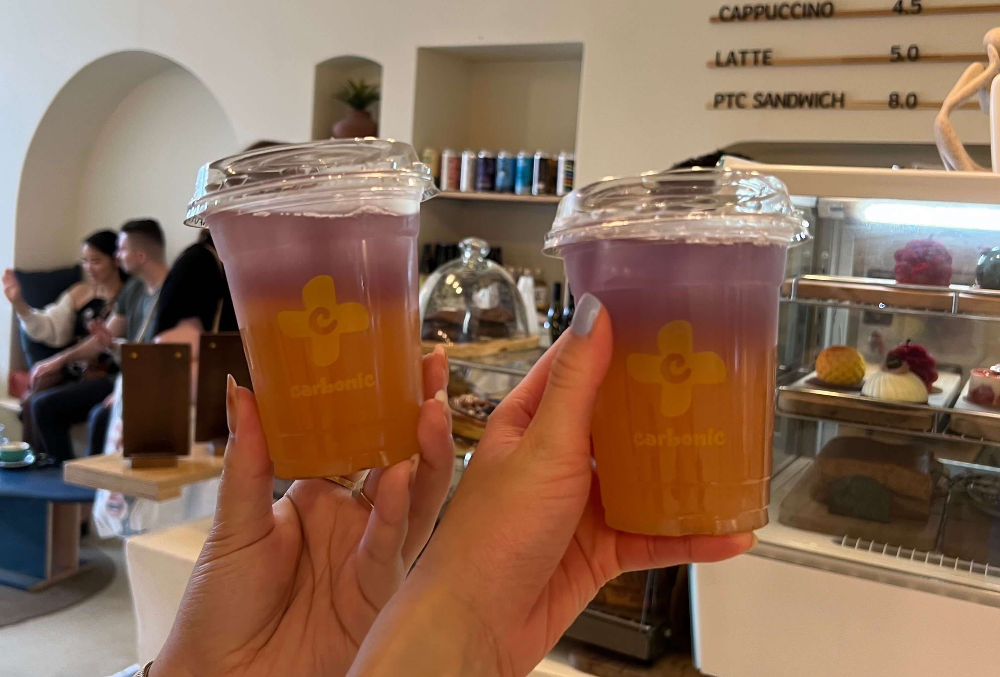
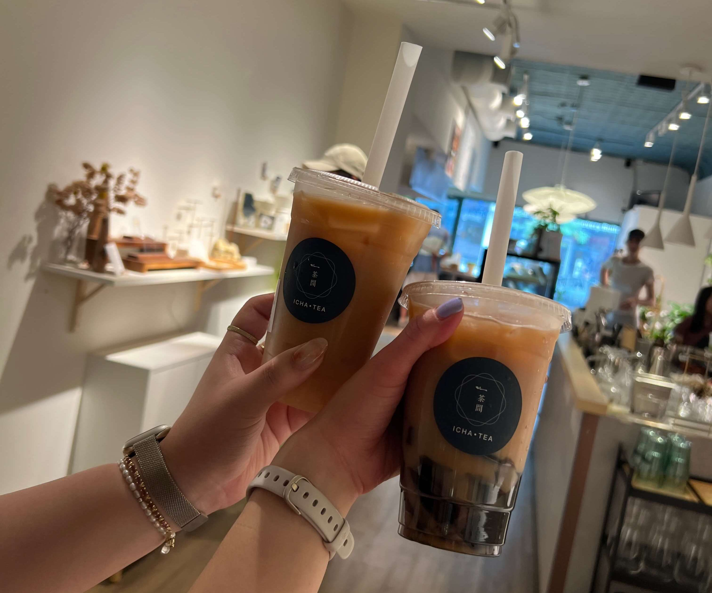
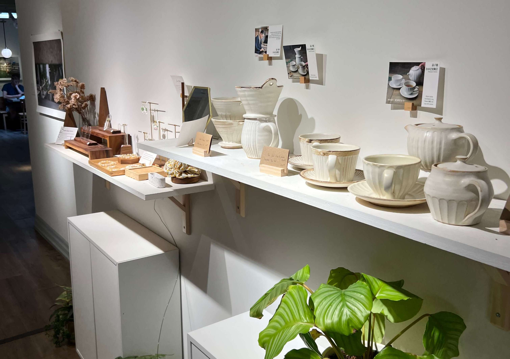

Our first (and last) full day in Toronto started out with brunch at Light Cafe, a cute Taiwanese-inspired cafe about a ten-minute walk from our hotel.

The food took a while to be served, but any possible annoyance dissipated when we dug in. First of all, the portion sizes were _massive_, and secondly, with all the items packed onto the plate, I was skeptical that all of them would taste good, but somehow they pulled it off.

    

My favorite part was probably the eggs benedict, but I also loved the mix of sweet and savory between the mini pancakes and the waffle fries.

Post brunch with our bellies full, we walked around nearby aimlessly and happened upon a vintage clothing store called Street Cvlture. Both of us spent way longer inside than intended, and by the time we left the store, our arms were full with very satisfactory purchases.

    

At this point the midday sun was beating down on our backs and we were free of our food comas, so we stopped by a cute coffee shop called Carbonic Coffee. We ended up ordering the last of their Blue Sakura teas.

    

One of the most-recommended spots to visit in Toronto is the Distillery District. It's a little ways from the main downtown area, so we popped into an Uber after dropping off our vintage finds at the hotel.

The Distillery District actually reminded me of the Faneuil Hall/North End part of Boston. Similar red brick-paved walkways and historical ~ vibes ~. The district itself is full of shops with wildly different vibes (high-end fashion, antiques, alcohol tasting, knick knacks) and also has a courtyard of handmade goods.

    

Afterwards we popped into another Uber to Queen Street West, another area of Toronto known for unique boutiques and thrift stores. It was also time for another thirst-quenching drink, so we stopped in a teahouse called ICHA, and proceeded to have some of the best milk teas we'd ever had, in one of the most aesthetic teahouses we've ever seen.

We both got the chrysanthemum pu'er milk tea.

    

 

    

Rejuvenated, we shopped for a while along Queen Street West, but didn't find anything particularly of interest. Feet tired and stomachs hungry, we walked to the nearby Chinatown neighborhood to try another highly-recommended Toronto food spot.

Juicy Dumpling is a hole in the wall, slightly dinky looking, takeout-oriented Chinese counter-serve. But the line went out the door, and for good reason. $4 CAD for six soup dumplings, $5 CAD for four pan-fried buns?! Surely too good to be true!

    

But it was indeed true. We got soup dumplings, pan-fried buns, spicy wontons, and chicken nuggets to share between the two of us.

The XLB had super thin, delicate skin, and were bursting with broth (living up to the restaurant's name). The pan-fried buns were also way juicier than I had expected, and weren't too greasy like most pan-fried buns. The wontons were not what I expected since I'm used to the Din Tai Fung ones with creamy sauce, while these were simply stir-fried in chili oil, but my friend really liked them. The chicken nuggets were also made with real chicken pieces instead of ground chicken.

    

Especially given the price point, I would say Juicy Dumpling is a must must _must_ visit if you're in the area. Those XLB are truly one of, if not _the_ best xiaolongbao I've ever had (sorry DTF...).

After idling around in a nearby pharmacy for half an hour to wait for our digestive systems to clear up a little, we headed to _after seven_, a Japanese-inspired speakeasy hidden behind a yogurt drink shop.

Since we didn't make a reservation, we were seated at the bar (which was fine). For our first round, I got the Cloudy Oolong, and my friend got the Pandan Panda. Both were fantastic, and my friend liked the Cloudy Oolong so much that she ordered it for her next round. They also came with bar snacks (Japanese rice crackers)!

    

Round two - I got the Flamango - also quite good, but stronger (taste-wise) than the Cloudy Oolong.

    

Overall, the vibes of the speakeasy were lovely, and I'd recommend making a reservation if you want to sit a table!

And... that's a wrap on day 2.

_tags: location/canada, toronto downtown, shopping, asian food, cocktails_
