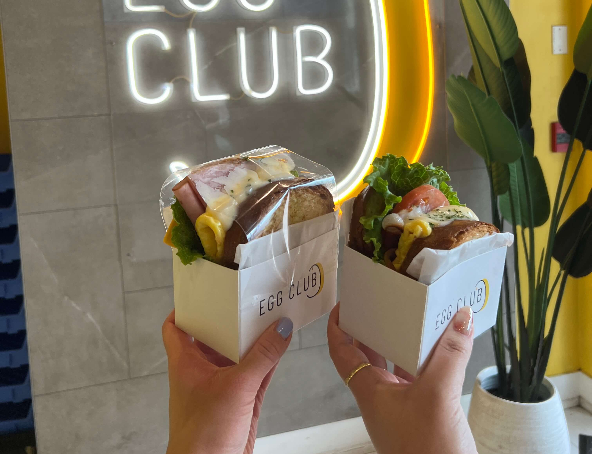

On our last (half-)day in Toronto, we hit up this Korean egg sandwich breakfast shop in Yonge-Dundas called Egg Club. If you remember my friends' and my obsession with <a href="https://clarityeats.com/koreaDay5/">EGGDROP in Seoul</a> one year ago, I had spent the past year searching for worthy alternatives elsewhere, to no avail. Last September I tried an egg sandwich shop in Yilan City, Taiwan called TOASTMAN 吐司男 that was alright as a standalone, but still nowhere close to EGGDROP. In NYC there's a cute little place called Semicolon Cafe that has good vibes, but their sandwiches are overpriced (like everything else here) and too Westernized. So my friend and I had medium expectations for Toronto's Egg Club - we didn't expect it to be close to Egg Drop, but hopefully better than the other ones we've tried.

Surprisingly, these sandwiches impressed both of us. The milk bread was fluffy and soft and quite comparable to EGGDROP actually - and the fillings and sauces were flavorful and reminiscent of the delicate balance of ingredients in EGGDROP's sandwiches. The prices were also very reasonable at $7-8 CAD per sandwich.

    

Probably the closest to EGGDROP you can get here - so definitely recommend!

The only thing was that they didn't really have a beverage selection, so afterwards we hit up a boba place called Cha Miao Miao for mango slushies.

    

Pretty good mango pomelo drinks, if you're into that. They also have a pretty wide selection of other drinks too, so there's something for everyone.

We spent the rest of our remaining time wandering aimlessly around the city and browsing the CF Toronto Eaton Centre, a massive mall that is apparently the busiest shopping mall in North America, according to Wikipedia.

For a late lunch, we got Lanzhou beef noodles at a restaurant called GB Hand-Pulled Noodles. If you've ever heard of Dunhuang, the massive franchise spanning from the West Coast to the East Coast, these are the same kind of noodles. At GB, you can customize your noodle type - thin and round or thick and flat, and the amount of noodles you get - small for the average human, extra-large for the competitive eater (JK, but really, the portion sizes are insane - see below for the "small" portion).

    

Before heading back to the hotel to pick up our luggage, we made a final stop at Hazukido, a Japanese bakery specializing in croissants. Unluckily, all the croffle flavors that my friend wanted were sold out, so we got drinks instead (yes, the second boba of the day). The drinks were decent, and there's a wall in the back that is perfect for a photo-op.

    

And thus, our Toronto adventures ended here. Or not really, because our flight ended up getting delayed a million times and then cancelled and we had to stay an extra night (guess which airline 😍). But barring airport hardships, I would say the trip was overall a success (especially the parts where we went to Gyubee and Juicy Dumpling).

If you ever visit Toronto, let me know if you try any of these places, or discover other ones that you think I should try!

_tags: location/canada, toronto downtown, shopping, asian food, japanese bakery_
