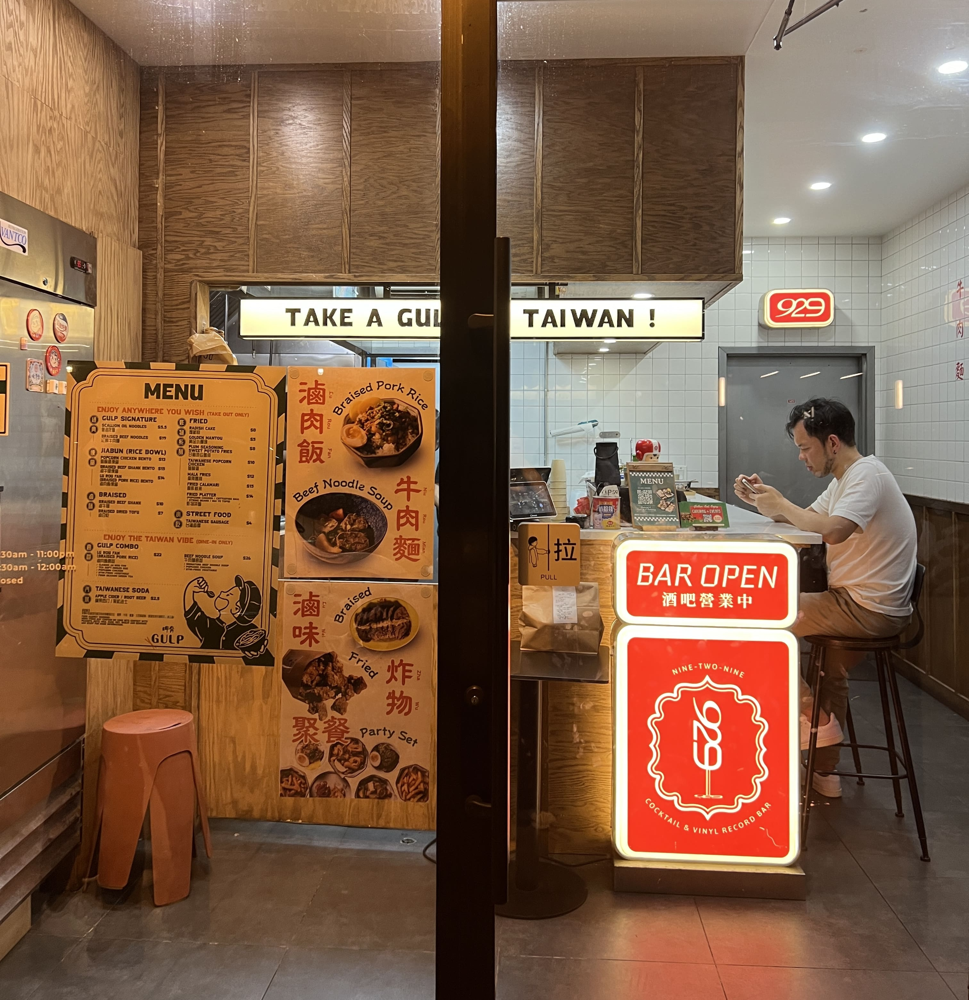
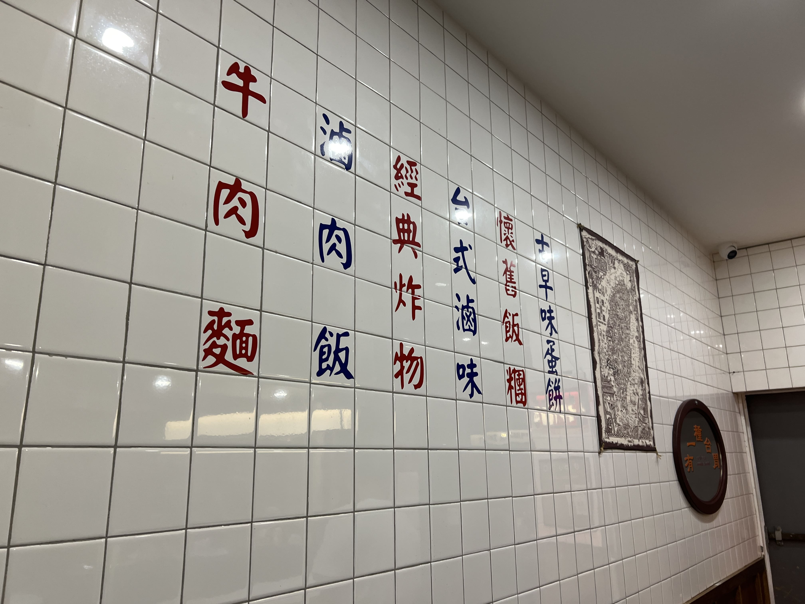
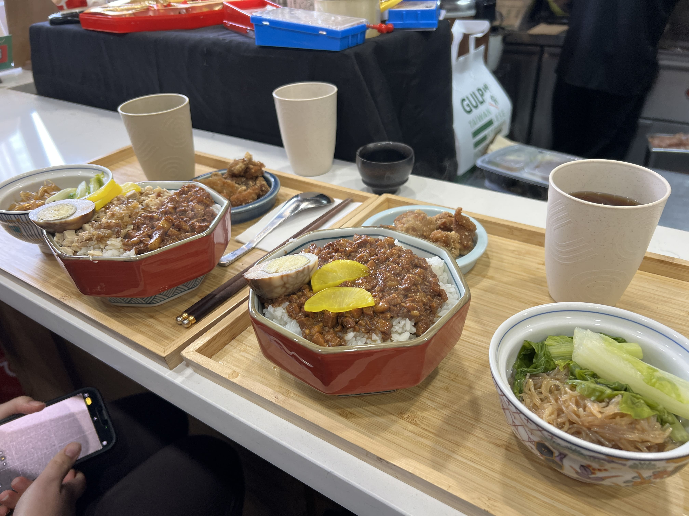
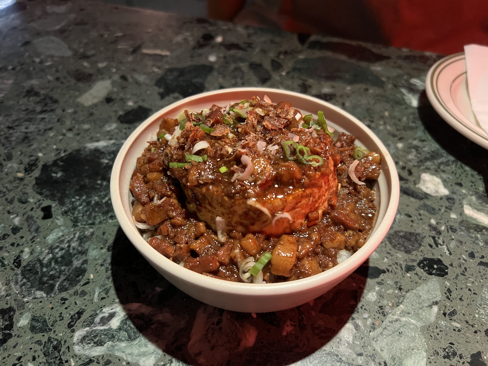
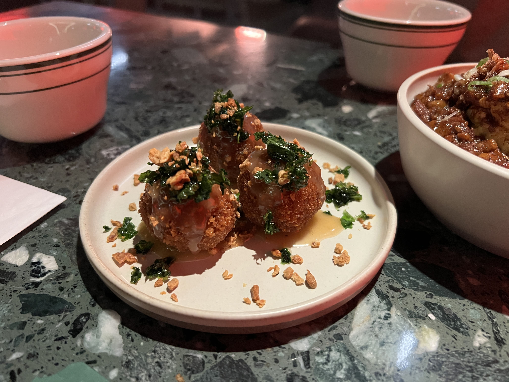
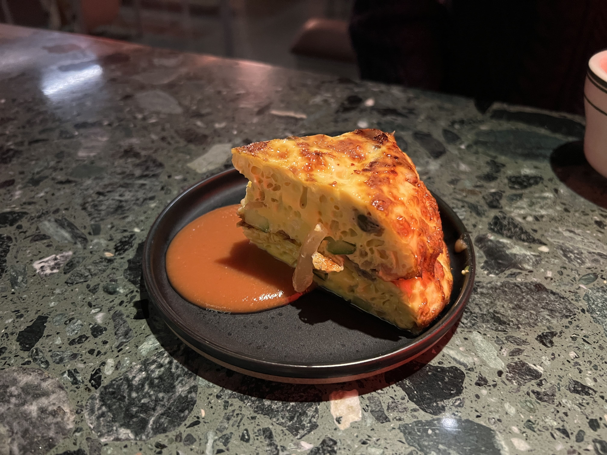
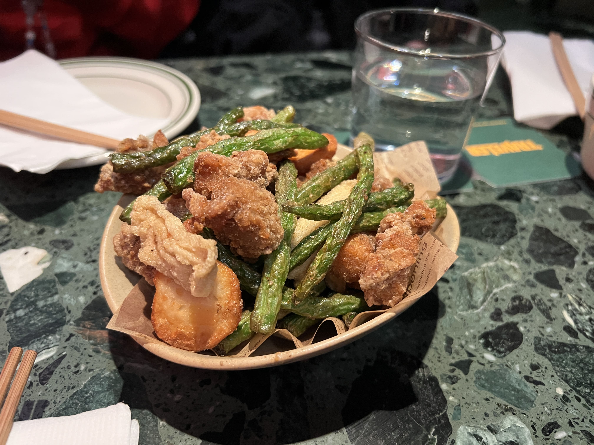
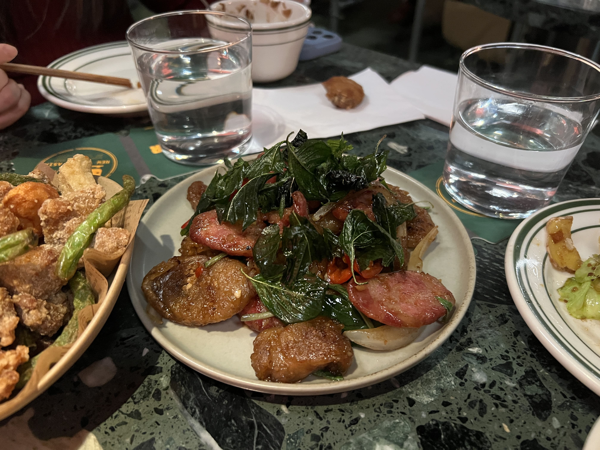
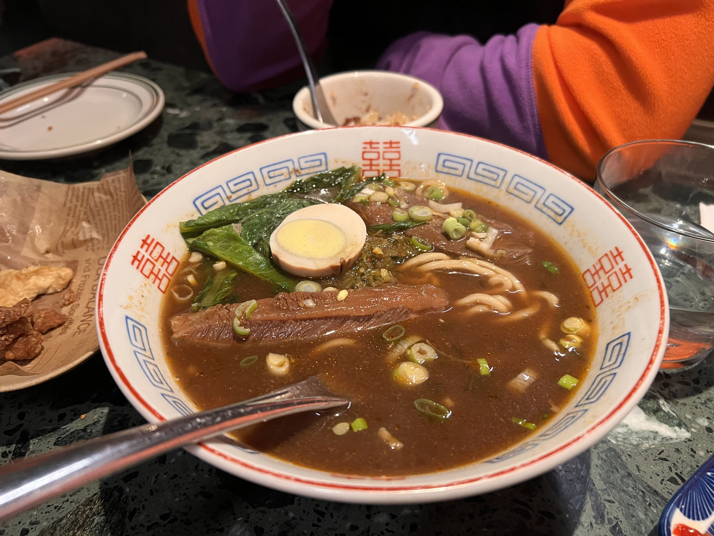

As many of you know, I'm always on the hunt for good Taiwanese food in the States. Unfortunately, there aren't a lot of truly authentic ones I've come across so far. Taiwan Bear House in Manhattan Chinatown is one that's nice for takeout, and I heard there are some good ones in Flushing and Elmhurst, but within the general vicinity of Manhattan, the options are quite limited.

Thus I was so excited to discover Gulp in Long Island City (to be fair I discovered it a couple years ago and am only writing about it now... you get the point), and was even more excited when they opened a sister location in Midtown with a larger dine-in section called Traveler.

First, about Gulp LIC.

    
    <small>Entrance of Gulp LIC</small>

Upon entering, you really feel like you're in a breakfast shop in Taiwan. They're frying chicken and whatnot right in front of you (half the kitchen is right behind the counter seating), and the wall even has menu items stenciled on (although mostly for show I think, since they don't sell 滷味).

    
    <small>Wall inside Gulp LIC</small>

The dine-in menu is not particular extensive - you get more things if you order takeout. But the nice thing about the combo meals is that they come with popcorn chicken and also an iced tea that is somehow one of the best iced teas I've ever had (it used to be jasmine green tea and they recently switched to floral black tea and somehow both are amazing). And also the dine-in portions are larger than the takeout portions, I believe.

    
    <small>Set meals at Gulp LIC</small>

I really like their luroufan and popcorn chicken, and their beef noodles are great as well. The only thing I would recommend against is probably their chicken rice - it's a little dry and meh.

The other downside about dining in is that there are literally only 5 counter seats so if you come at peak hours you probably have to wait.

Which serves as a great interlude to Traveler - their fusion-esque, dine-in friendly sister restaurant in Midtown! (Caveat - all my visits were dinnertime, and it seems like they recently opened a lunch menu that is more reminiscent of Gulp's all-day menu, and completely different from their dinner menu.)

For starters, I really like how Traveler strikes a great balance between fusion and authenticity. Their luroufan with steamed egg is one of the best luroufan I've ever had:

    
    <small>Luroufan at Traveler</small>

The steamed egg was melt-in-your-mouth tender and mixed perfectly with the rich, fatty braised pork into the most wonderful bite. I swear I dreamt about this luroufan for days after.

And the "Tainan Arancini" was surprisingly delicious and had a nice kick with the plum sauce. (Although I will say, they changed the recipe for this recently because the most recent time went, it looked and tasted a bit different... I personally liked the old one better!)

    
    <small>Tainan Arancini at Traveler</small>

The oyster omelette was a bit of a disappointment for us - we expected it to be a bit more like a normal 蚵仔煎 with more egg but it was actually just a straight up frittata. This part might've just been a personal preference - I looked it up later and it seems like some people make 蚵仔煎烘蛋 a bit thinner and others make it thicker. But the part that got me was that the oysters were _tiny_ - even with two hefty slices of the "frittata" each piece had at most 1-2 oysters the size of a littleneck clam, perhaps even smaller (I'm not exaggerating). So I personally wouldn't recommend this dish, although it seems like it's quite popular, so to each their own. In any case, the disappointment from this dish wasn't enough to overshadow how much I loved the luroufan and the arancini.

    
    <small>Oyster Omelette at Traveler</small>

I came back again (obviously) multiple times and ordered more dishes:

The fried platter was good, pretty much what you'd expect getting at a late-night takeout in Taipei. The Basil Sausage brothers was also very yummy.

    
    <small>Fried Platter</small>

 

    
    <small>Basil sausage brothers</small>

I also really liked the beef noodle soup - it exceeded my expectations and I would probably place it somewhere up there along with the luroufan with steamed egg, ranking-wise. The broth was deep and flavorful and the noodles were perfectly chewy.

    
    <small>Beef noodle soup</small>

I will conclude this post by saying... LIC Gulp no longer serves breakfast :cries: - but they have it at Midtown now, so if you're craving your morning fantuan or danbing, go check it out!

_tags: location/nyc, food recommendations_
