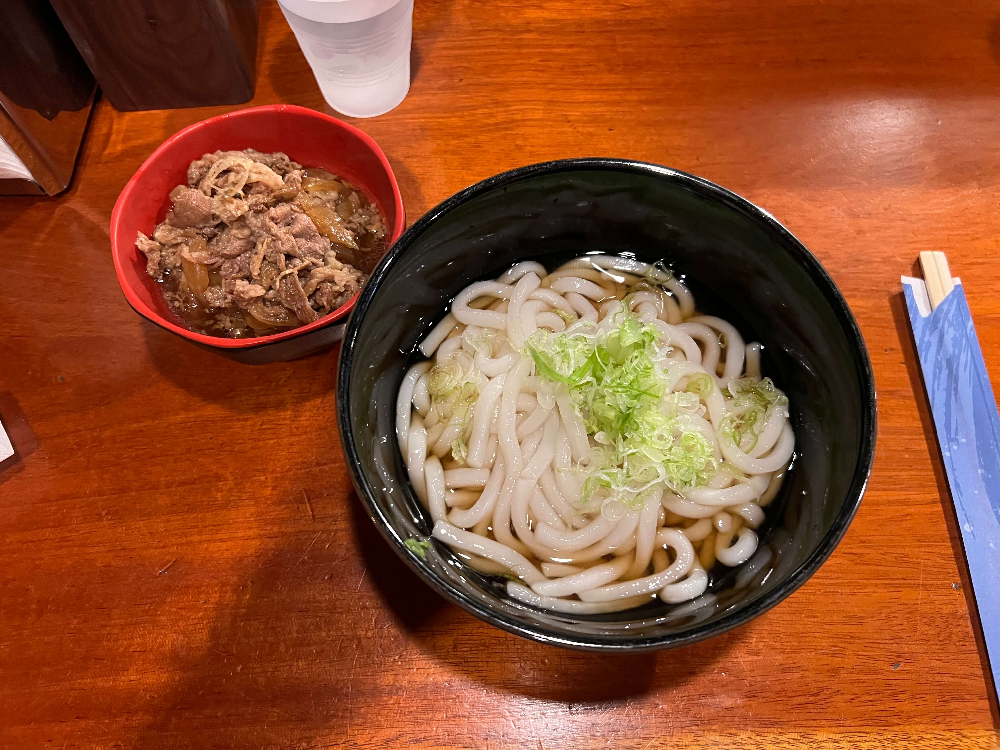

Next in the udon series, I present to you _Udon St. Marks_, my ultimate, go-to, number-one-in-my-heart comfort food udon restaurant. This hidden gem of East Village's St. Marks Place was unfortunately closed for the past year due to interior renovations after a fire. I was extremely relieved to see that they have reopened, and that the menu has remained exactly the same.

    

My favorite thing about Udon St. Marks is that (1) most of the menu items come with both hot and cold options and (2) their prices are way below what you'd expect from a full-service Japanese restaurant in one of the most prime locations of Manhattan. You can get a full meal for under $12 USD, which is practically unheard of here.

Other than that, the offerings are pretty typical. They have your classic niku udon, ebi-ten, kitsune, wakame, nabeyaki, karaage, and also larger sets and dons if one bowl of udon isn't enough to satisfy. The noodles are just the right amount of chewy, and the broths are umami and not too heavy.

    

The only caveat is that they're cash-only, so make sure to hit the ATM before coming! (If you forget though, they have one right outside the entrance.)

_tags: location/nyc, japanese cuisine, udon noodles, st marks place, east village_
