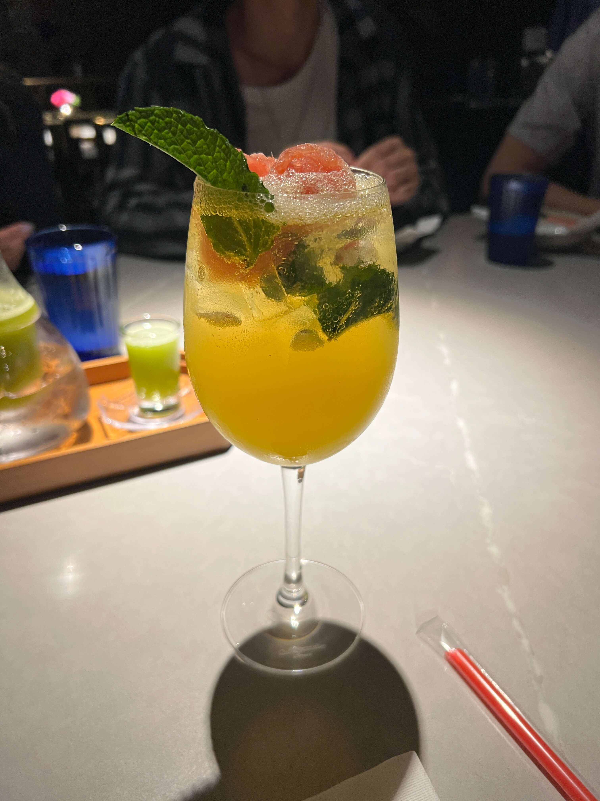
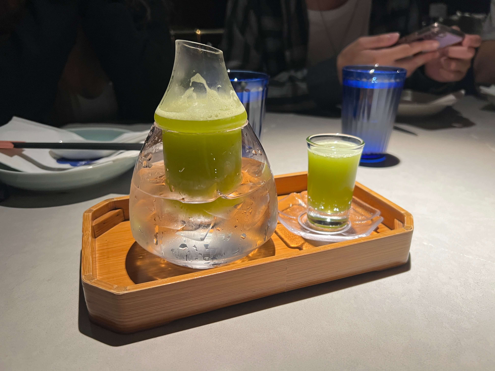
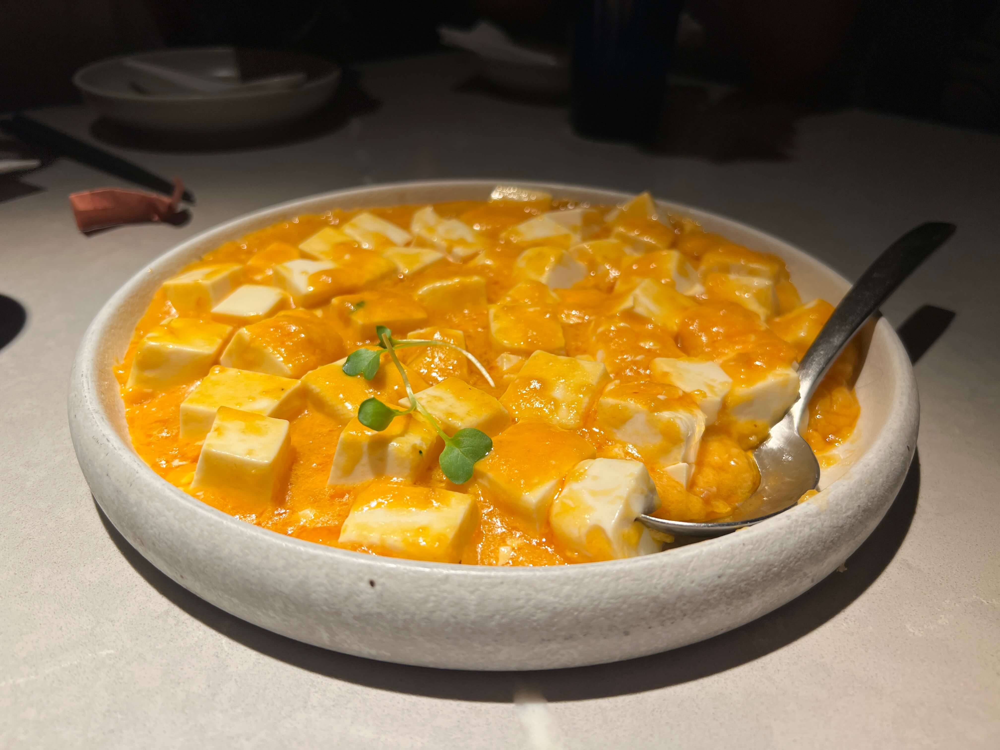
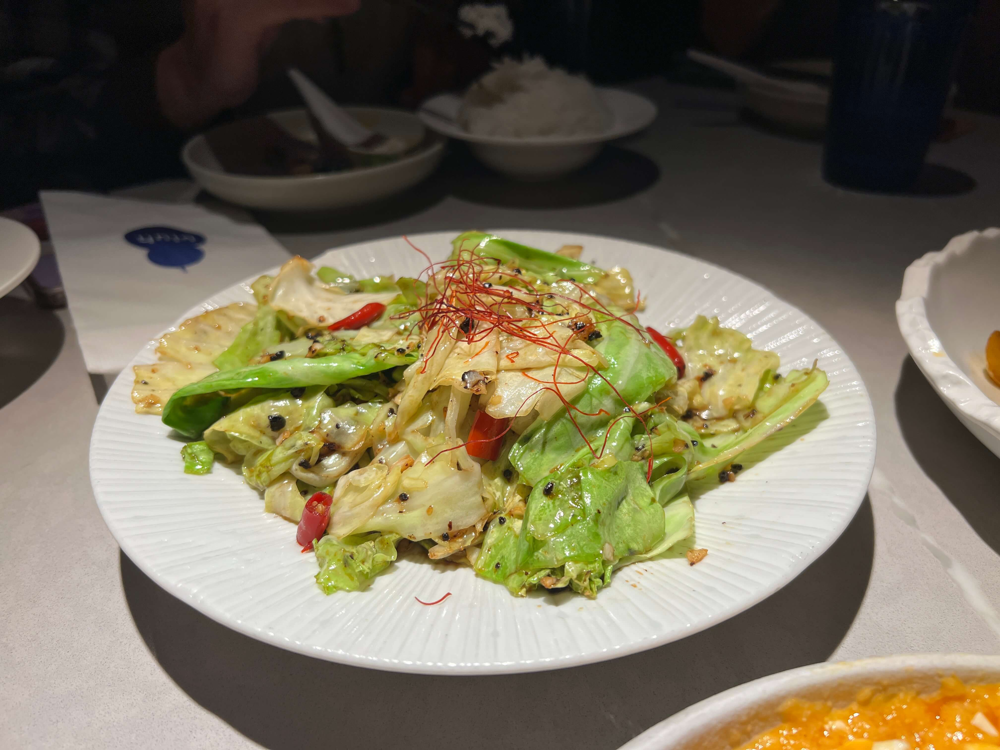
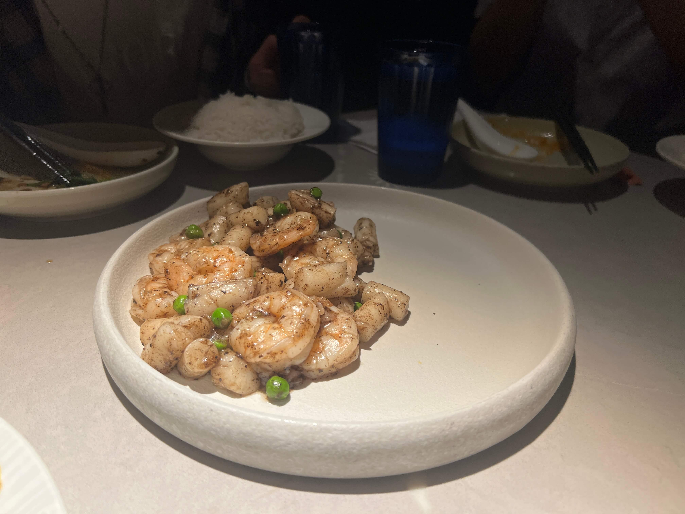
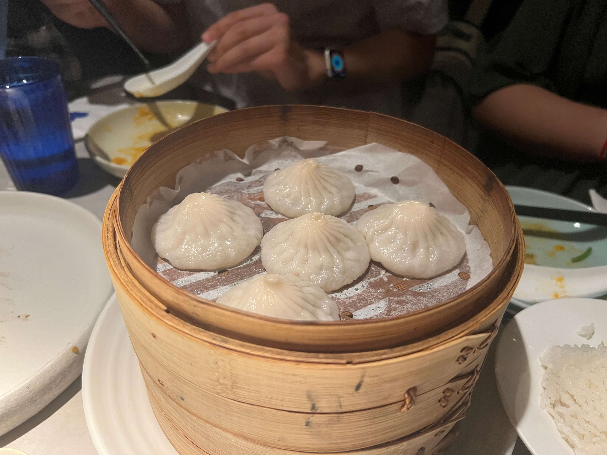
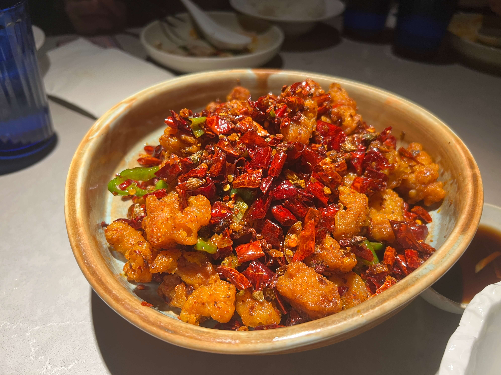
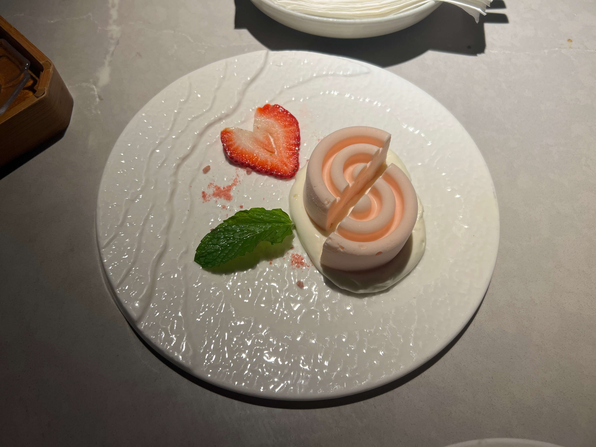

This place has been on my want-to-go for years, but only recently did I discover that uluh was in fact, hulu 葫蘆 (gourd) backwards, the Chinese name of the restaurant, and also the image of the logo.

The restaurant doesn't specialize in a particular style of Chinese cuisine, which I would say under normal circumstances is a red flag for sure (having good Sichuan dry pot AND Cantonese dimsum? Unheard of...). In addition, the menu is quite extensive, which is usually also a red flag. However, I took a leap of faith given the fantastic reviews from our lovely Google and Yelp reviewers, and went with a large group to try as many items as possible.

Intrigued by the cocktails, we got the _osmanthus oolong_ and the _tipsy peach_. The latter was sort of what you'd expect from the name - a sweet, fruity cocktail with virtually no alcohol aftertaste.

    

The former was much more unexpected - it came in a very peculiar glass tea pot? infuser?, and the taste was not only osmanthus-y but with a overtone of plum as well. We did not expect this cocktail to be fruity and sweet, but it was, and in a very pleasant way. My friend and I thoroughly enjoyed it.

    

First dish to land on the table was the crab tofu. The tender silky tofu was covered generously in a savory egg yolk sauce mixed with crab bits. This one was a group favorite.

    

Next was the stir-fried fatty beef with cilantro. This was your standard Sichuan fare, similar to a dry-pot beef situation. I usually hate cilantro, but in these kinds of dishes, the depth of flavor it adds is a huge plus.

    

Third to appear - the stir-fried cabbage with soy sauce. We expected a pretty typical Sichuan/Hunan dish, but this cabbage was one of a kind. Something about the seasoning made it stand out from all the other stir-fried cabbages I've had at Chinese restaurants. I think I've previously mentioned that the stir-fried cabbage at Szechuan Mountain House is my long-standing favorite, this one at uluh threatened to overturn that first place designation.

    

Now the next dish was an interesting one - the black truffle & shrimp rice cake. The plating was a bit bizarre, and I did not expect the little green peas (I'm guessing a purely aesthetic choice). I'm personally not a huge fan of truffle in general, but the truffle flavor wasn't as overwhelming as I had expected, and I liked the other seasonings they had thrown in there. Overall quite a pleasant dish, would recommend.

    

Next, the obligatory xiaolongbao. We got both the regular pork XLB and the crab XLB, since there were five each and six total people. They were decent, but nothing too special (skins could've been thinner imo).

    

Last but not least, the Sichuan chili fried chicken (laziji). I can't comment much on this dish because the spice level above what I was able to comfortably tolerate... the menu had three chili symbols, and perhaps we should've proceeded with more caution, but there have rarely been any laziji dishes that I haven't been able to handle, and most people in our group had pretty decent spice tolerances, yet most of us were in tears after a few bites. All I can say is - I'm sure the dish is amazing! If you can handle it...

    

For dessert (mostly to cool our burning mouths), we got the rose lychee panna cotta. The plating was magnificent, although the panna cotta itself was a bit different from what I'd expect of a panna cotta (it was quite hard to carve into with my spoon). I haven't had that many panna cottas though, so maybe that's just how it is sometimes.

    

Overall ranking (minus dessert and drinks):

1. Stir-fried cabbage with soy sauce (absolute must-order)
2. Crab tofu (absolute must-order)
3. Black truffle & shrimp rice cake
4. Stir-fried fatty beef with cilantro
5. Xiaolongbao
6. Sichuan chili fried chicken (at bottom of list only because I couldn't eat it)

Overall recommendation: please check it out! uluh definitely exceeded expectations, especially in light of all the cuisines and dishes that it offers. It's on the more upscale side though - if you want a cheap, casual Chinese counter-serve, this is definitely a far cry from that.

_tags: location/nyc, chinese food, sichuan food, shanghainese food, cantonese dimsum_
