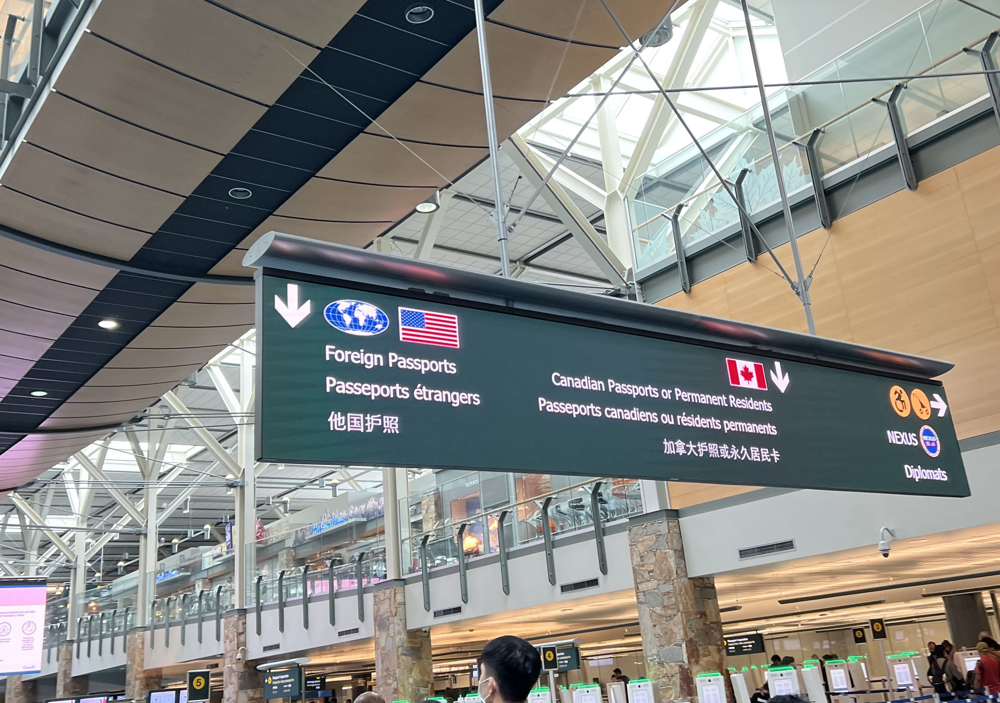
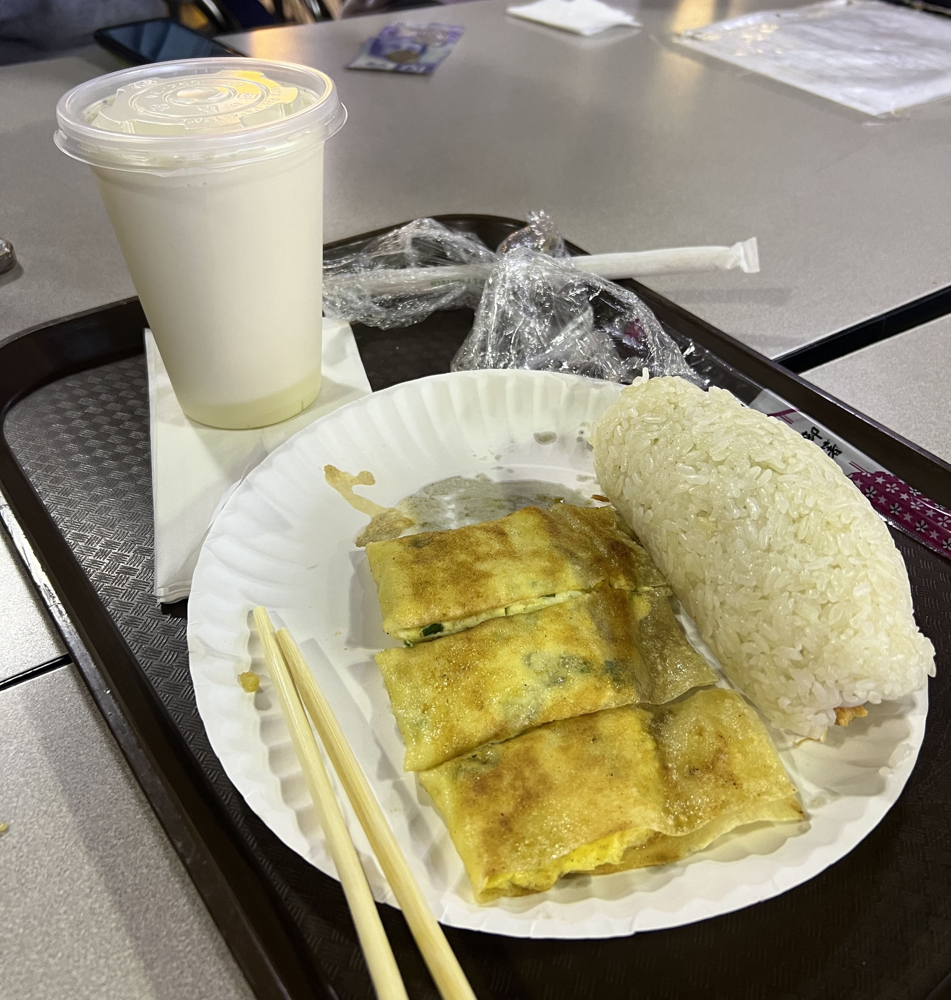
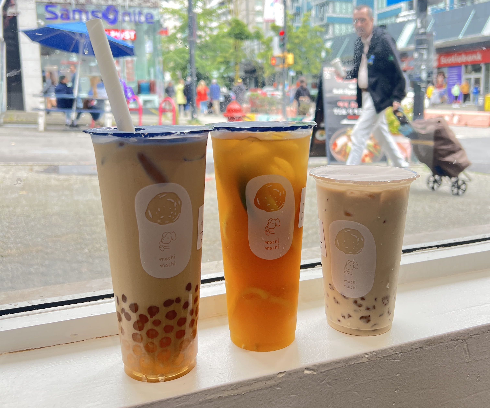
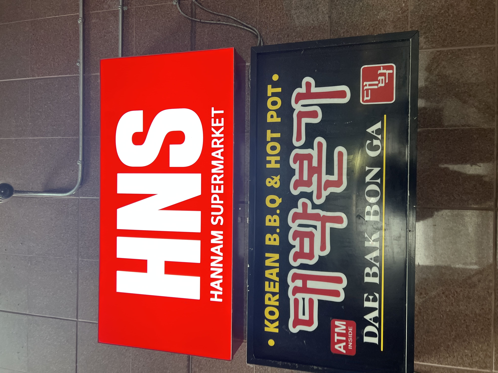
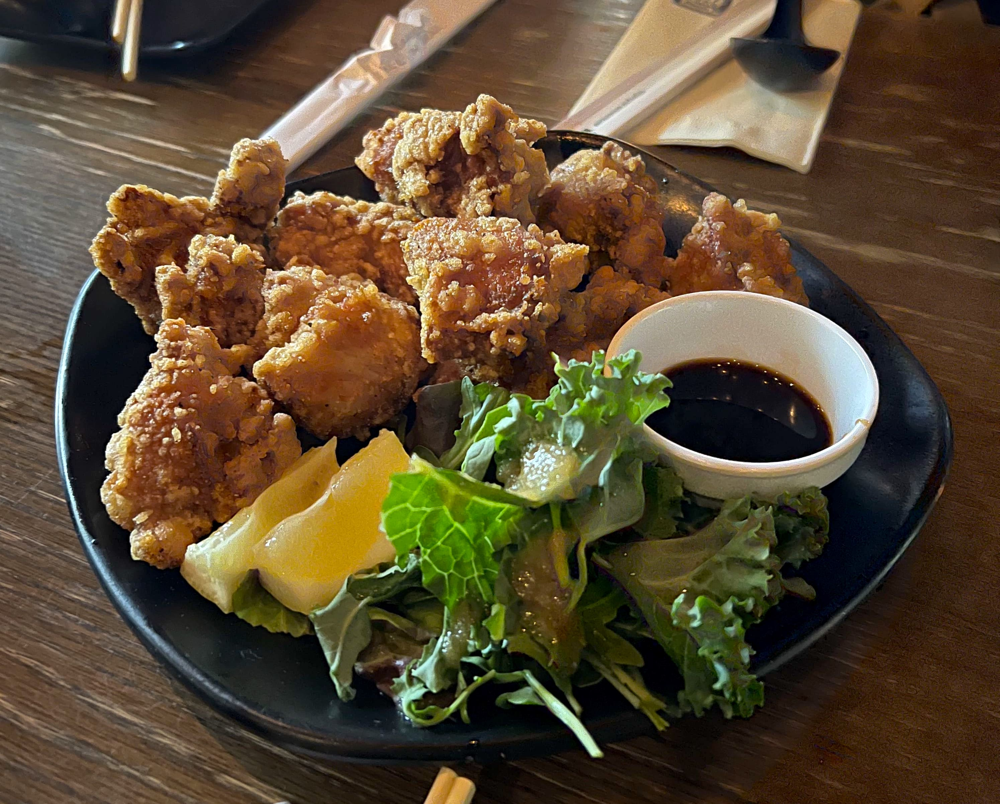
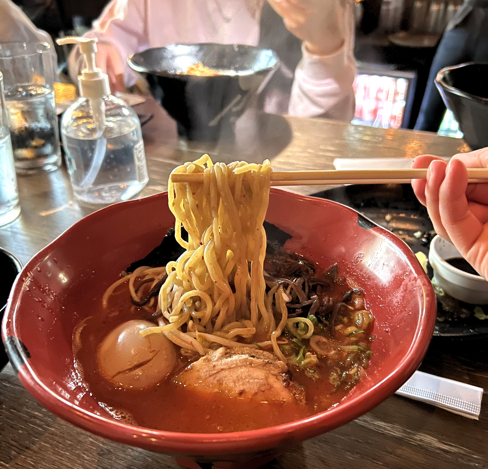
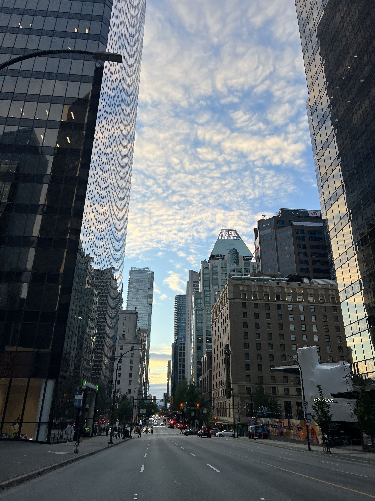
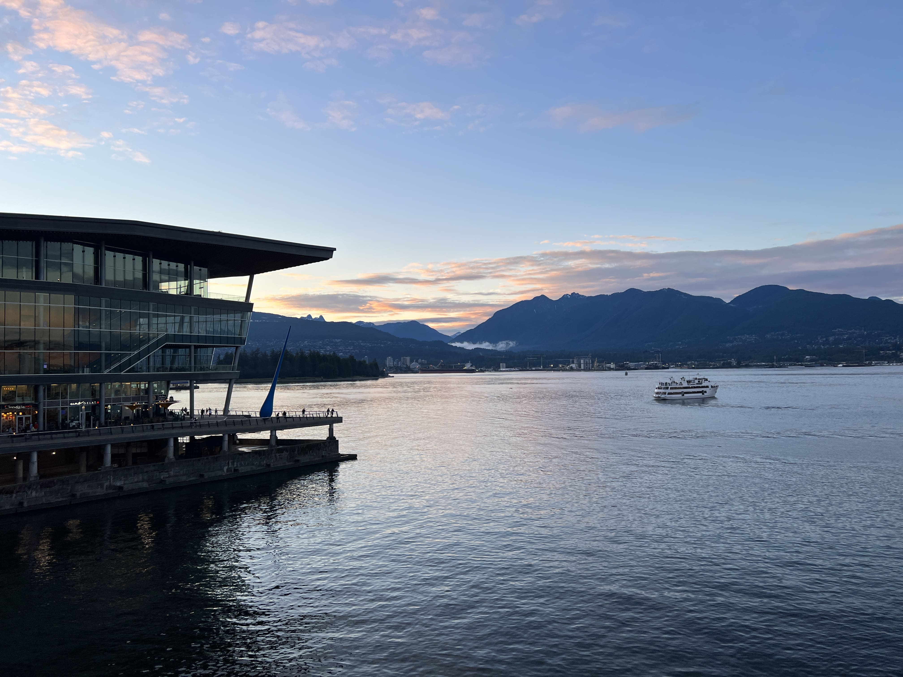
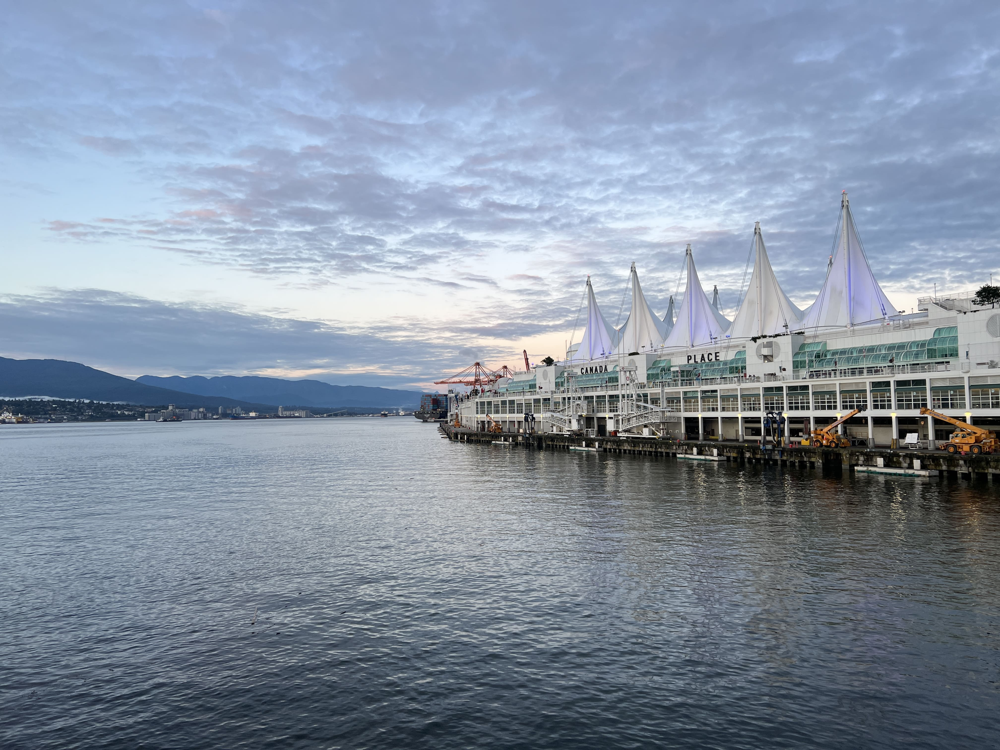
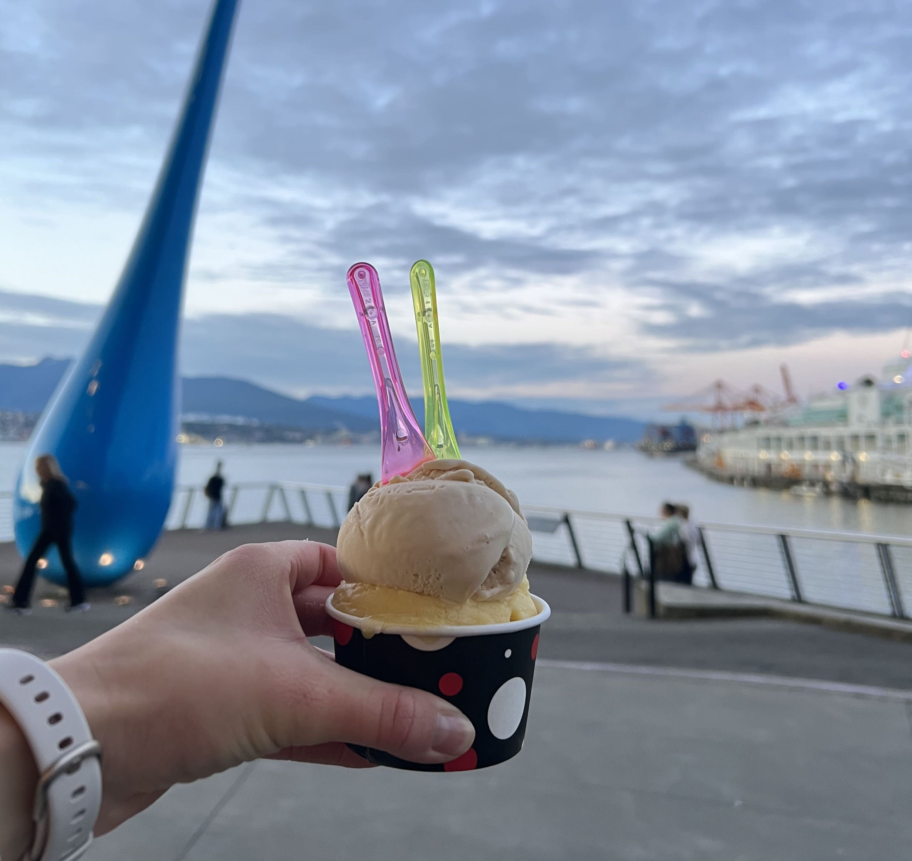

Escaping the United States on the Fourth of July like true Americans, we arrived at the Vancouver International Airport around 11 AM and got through customs after about half an hour of waiting. 

    

We were starving at this point so we decided to make a stop in Richmond for a late breakfast. We found a Chinese food court in a building called President Plaza, with an assortment of counters that sold everything from noodles to baozi to youtiao and fantuan. 

My friend and I got a Taiwanese fantuan (rice roll) + danbing (egg crepe) + soymilk combo from a place called Yung Ho Soy Drink to share. I will warn you that it cost extra for the soymilk to be cold instead of hot, and they also charge for extra utensils. Money is hard to make these days, I suppose...

It cost CAD 13.00 total, and was just enough for the two of us with smaller appetites:

    

Afterwards we headed to Downtown Vancouver to drop off our stuff in our Airbnb and explore the city.

We lived close to Robson Street, which is a nice location - full of stores and restaurants and cafes, and the busy area extends for multiple blocks. I was surprised to find a Machi Machi on Robson Street - I had previously assumed it only existed in NYC. Their boba is always solid, although they stuff in a little too many pearls for my own personal preference.

    

There is also a wide assortment of Asian supermarkets and plazas - passing by these, I briefly wondered whether I was back in Seoul.

    

After making our way (downtown) through stores such as MUJI, Urban Outfitters, Oak + Fort, and countless others, our arms were heavy with shopping bags when we finally decided to find a place to eat for dinner. We settled for Jinya Ramen Bar, a decently famous ramen joint with locations all over North America. The wait for a table of four was around 20 minutes at 7PM on a Monday, but after we sat down and ordered, the food came rather quickly.

    

We got the chicken karaage as a safe appetizer choice (they had many options) and my friend and I split a Premium Tonkotsu Red. They have customizable spice levels from 1-10, but higher than level 6 means an extra $1 tacked on. We got level 4, which ended up being spicier than I had anticipated. It was not too much that it covered the umami of the broth (thank god) but next time I go I would probably choose a 2 or 3 to be able to enjoy it more (oops).

    

In the evening we decided to walk to the waterfront to see the sunset. We passed by a collection of reflective high-rises:

    

... and finally made it to the waterfront. The golden hour view was spectacular, and the water was glassy and calm. I always knew Canada was beautiful, but even in Downtown ?! - I could live here forever.

    

 

    

There is a small sorbet place there, and my friend and I split a double scoop of passion fruit and salted caramel:

    

It was the perfect sweet ending to our first day in Vancouver. ☆ 

_tags: location/canada, vancouver downtown, robson street, jinya ramen bar, machi machi_

