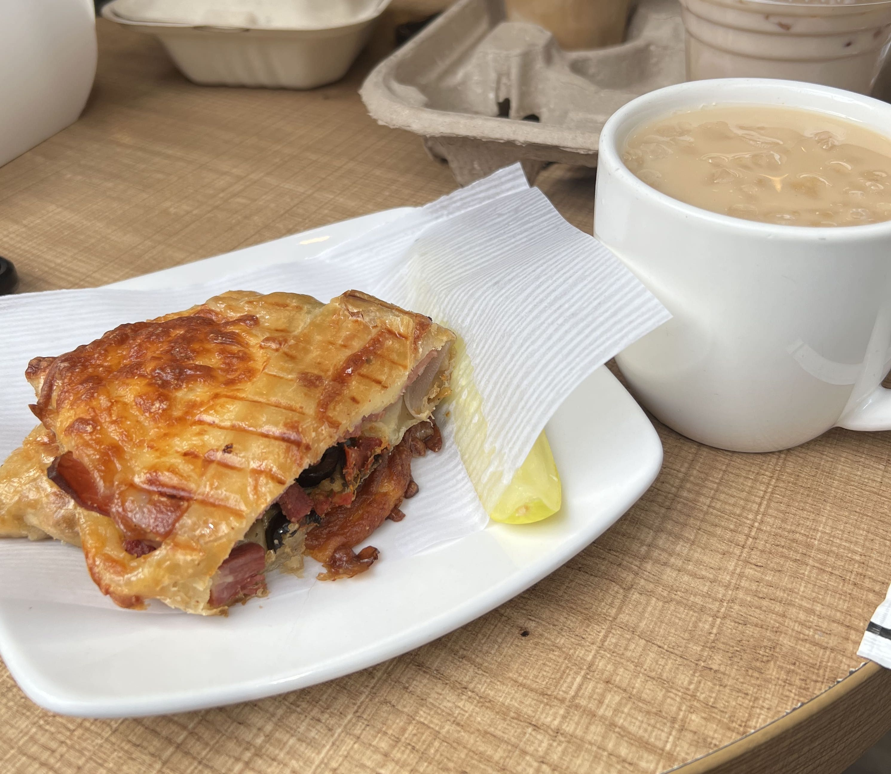
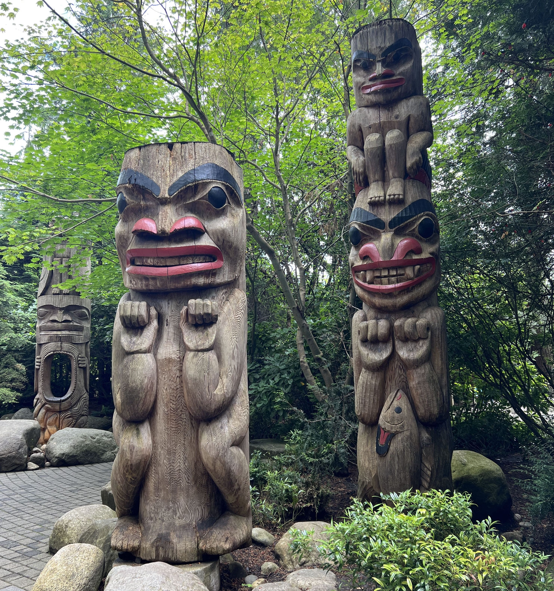
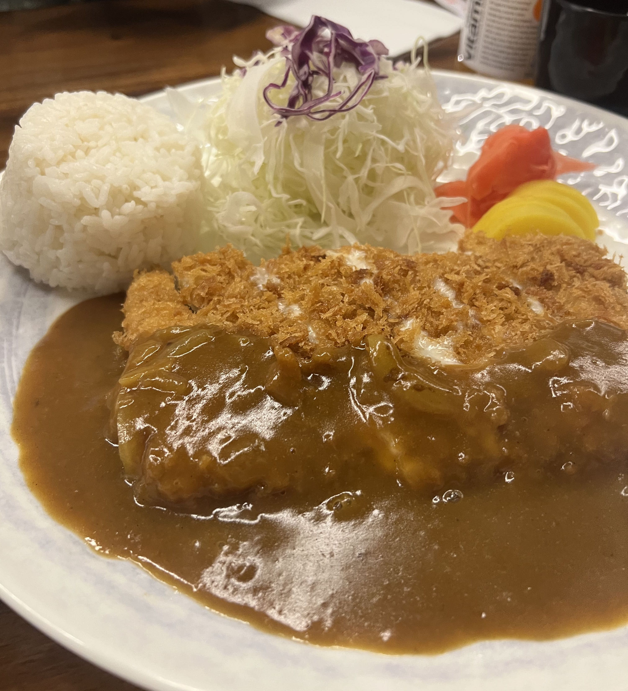

On the second day, after a quick breakfast at the 24 hours Breka Bakery & Cafe (why don't we have one in the States?!), we boarded the free shuttle to Capilano Suspension Bridge Park. I had been there once before when I was fairly small and have next to no recollection of the experience, besides the fact that I received one of those "I made it across world-famous Capilano Suspension Bridge" certificates for little kids, which stayed taped on my wall for many years after. 

    

The park was rather busy on a Tuesday morning, so luckily we had bought tickets in advance. 

    

We passed through a collection of somewhat menacing totem poles and (less-menacing) greenery before reaching the suspension bridge. 

    

There was a line of people filing onto the suspension bridge, both in the forward direction and back (although it wasn't nearly as crowded around 11:30 AM as it was when we were returning, a couple hours later). The view was spectacular - if you looked up you could see the tops of a majestic array of trees, and if you looked to the sides you could see natural waterfalls and a river.

    

  

    

After crossing the bridge there are a few different paths you can take, such as the Living Adventure, the Cliffwalk, the Treetops Adventure, and the Raptors Ridge. (I think we went through all of these but some of them were a little connected and I can't be 100% sure.) The view from every one of these "sub"-parks was phenomenal - swaths and swaths of green in all directions, from a view hundreds of feet in the air. I will say, though, that the Cliffwalk is seriously a psychological challenge for someone afraid of heights. The bridge was actually not that bad in comparison... 

    

 

    

In the afternoon we headed back to Downtown for a break and a quick lunch before going to Stanley Park, the next item on our itinerary. We ended up at Chungchun Rice Dog, only a few blocks away from the entrance of Stanley Park. 

    

Before entering the park we stopped at one of the bike rentals near the entrance ($7 per hour per person... not too bad) and boarded our bikes to cruise around the perimeter of the park, stopping at the Rose Garden and Prospect Point a couple of other attractions along the way. The rose garden was smaller than I expected but beautiful all the same, filled with patches of colored roses spread over a smooth grassy field. (However I will warn you that the ride up to Prospect Point is not for those with weaker thigh muscles.)

    

The hunt for dinner on a Tuesday evening was more difficult than expected - most of the popular dinner places along Robson Street had 30-60 min wait times, and after many trials and tribulations we finally found a nice-looking Korean-Japanese katsu place called Katsuya with open seats. 

    

They had honestly _way_ too many options for katsu (sweet chili, cheese, carbonara, curry, terri mayo, japanese, and more...), and my friend and I decided to split a curry cheese one since the portion sizes were massive. Gladly, the food lived up to the expectation and presentation. They even had an intriguing row of bread (?!) on the back counter that I was increasingly confused by (no, they did not sell bread on the menu) until upon inquiring the waiter we discovered that it was for the crumbs for the katsu!

    

The dinner had us quite full, but as you know, there is always room for dessert. There was a Sulbing two blocks away (not me reliving my Korea trip...) and we ended up splitting a Green Tea Strawberry bingsu. It was probably one of the best Asian desserts I've had in North America.

    

At the end of the day we had guiltily reclaimed all the calories burned from biking around Stanley Park, but in my opinion, it was worth it. ☆ 

_tags: location/canada, capilano suspension bridge park, stanley park, chungchun rice dog, katsuya, robston street, sulbing_

