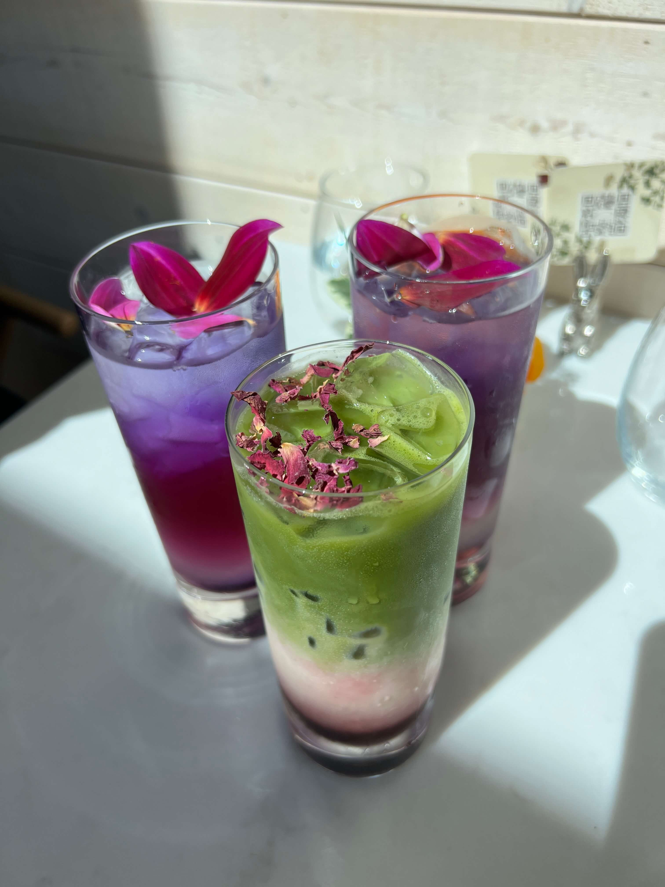
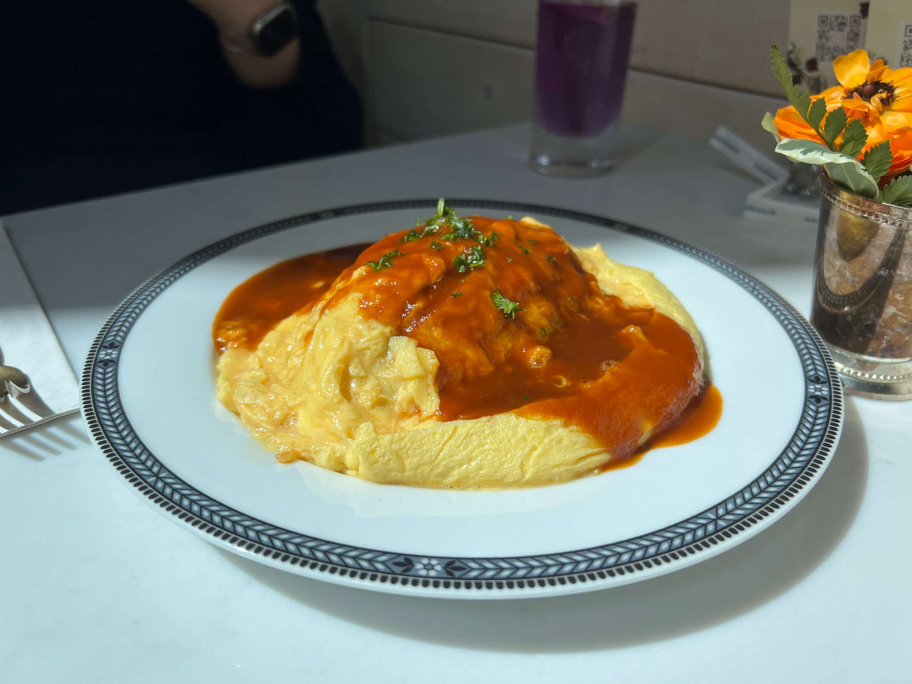
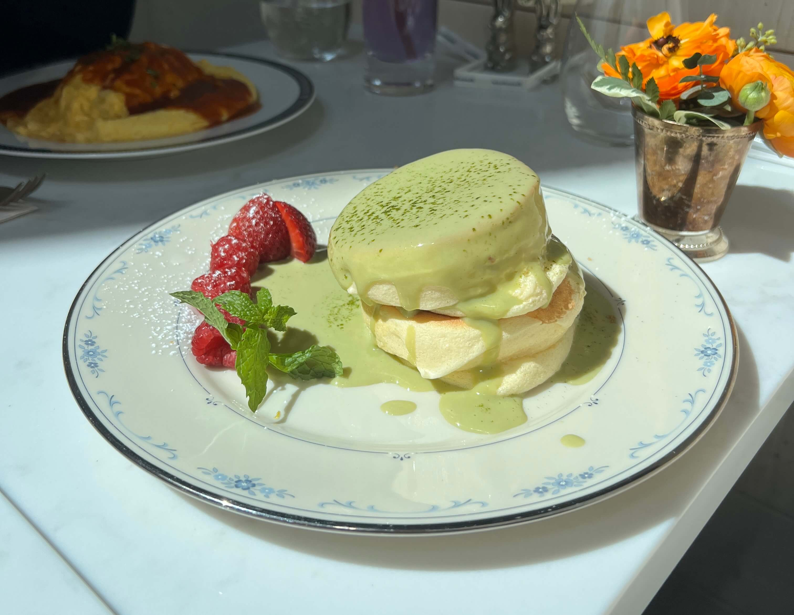
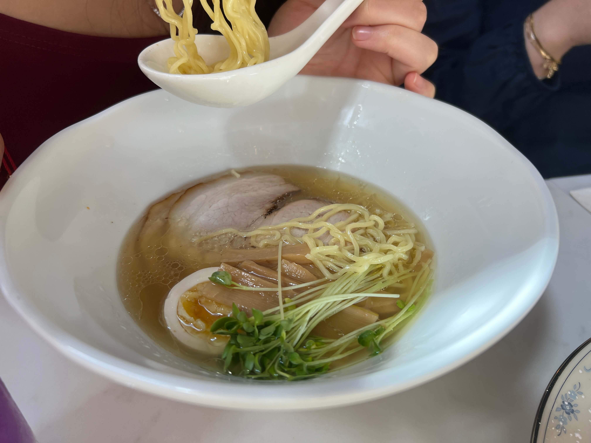

I discovered this LIC cafe via Instagram (as one does) and decided to make the trek into Queens and check it out with a couple friends for brunch.

Vert Frais is a Japanese cafe + ramen bar + cocktail bar all built into one. Produced by Michelin-starred Chef Nobuyuki Shikanai, their menu is compact and to-the-point. There's a few salad options, fluffy souffle pancakes, hamburg steak, Japanese omelet rice, and three types of ramen to choose from. They have a somewhat longer bar menu, as well as some specialty teas and coffees for those looking for a non-alcoholic brunch.

    

We got the lavender lemonade and the matcha rose latte, the aesthetics of which were unparalleled (look at those layers!!!).

For our main courses, I had such a hard time deciding between the ramen, the souffle pancakes, and the omelet rice. In the end I chose the omelet rice, and I convinced everyone to share a serving of matcha souffle pancakes with me.

    

The omelet rice was your typical Japanese-style omurice, although I wished they let us slice open the egg pocket (it came sliced). It was fluffy and flavorful and quite a lot of food - I was way too full after devouring the entire thing.

    

The pancakes were beautiful, obviously, but they also tasted really good. Usually I feel like souffle pancakes are one of those desserts that look nicer than they taste, but this time, they lived up to their exterior beauty. The pancakes were light and airy, and the matcha sauce was not too sickly sweet.

    

My friend got the shio ramen, so at least I got a photo. She found it a little too fatty for her taste so she asked for Tabasco sauce (LOL). I'll have to try it for myself next time to give a firsthand account.

Overall - very aesthetic cafe, would definitely recommend. Best souffle pancakes ever. If you're looking for a cute brunch place with a minimalist, floral interior that is great for food pics, this is the place to go!

_tags: location/nyc, brunch, long island city, queens, ramen, japanese cuisine_
