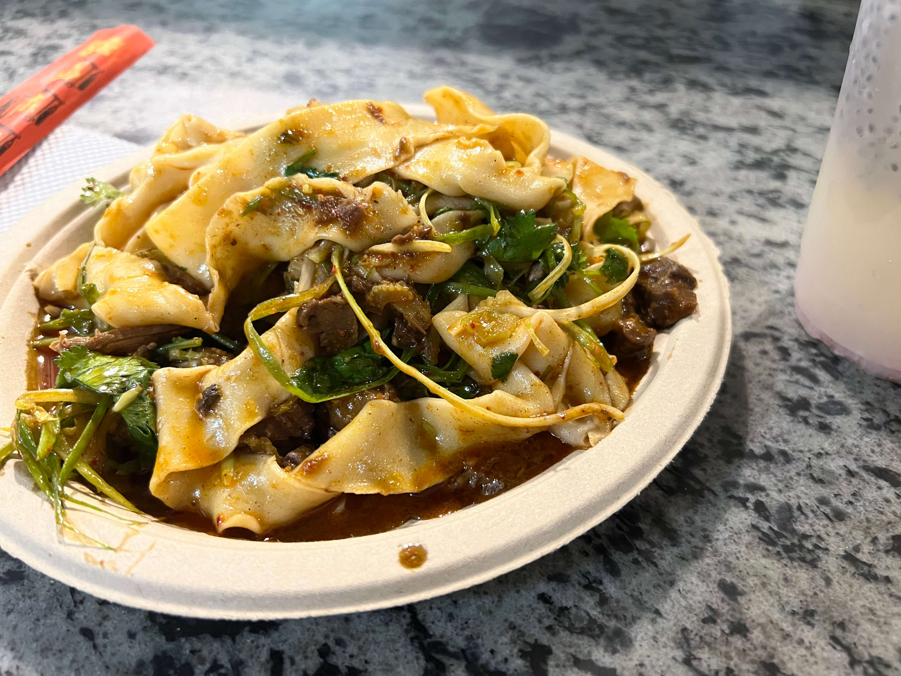

Short post but obligatory shout-out to my favorite _biangbiangmian_ spot in NYC! I think about these noodles often. Quite often, in fact. The wait does get pretty long around peak hours, so make sure to come early! Seating is very limited (read, almost nonexistent) but it is embedded in the middle of Chelsea Market, so you can find some tables outside if you walk a bit.

I always get the same thing (cumin beef tingly noodles, dry) so I can't speak much for the rest of the menu items, but if you like hand-pulled noodles, málà food (although these aren't particularly spicy in my opinion), etc. you will probably enjoy these.

    

If you haven't been to Chelsea Market, there's a bunch of little artisanal shops and bakeries to check out, so you can devour your noodles and proceed to shop a real-life Etsy marketplace right after. And if you get tired, there's a Starbucks Reserve right next door to caffeinate you right back up.

_tags: location/nyc, noodles, chinese food, chelsea market_
