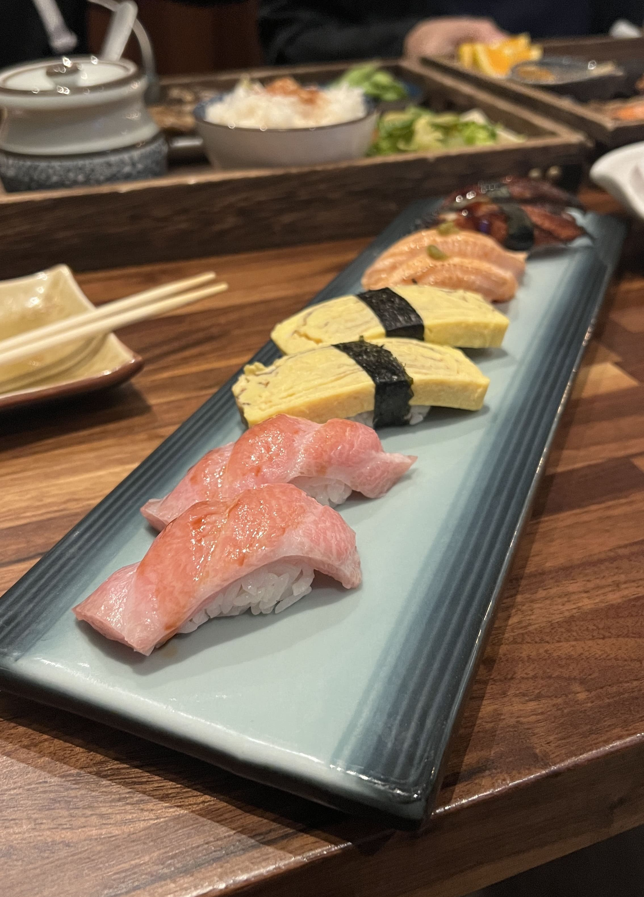
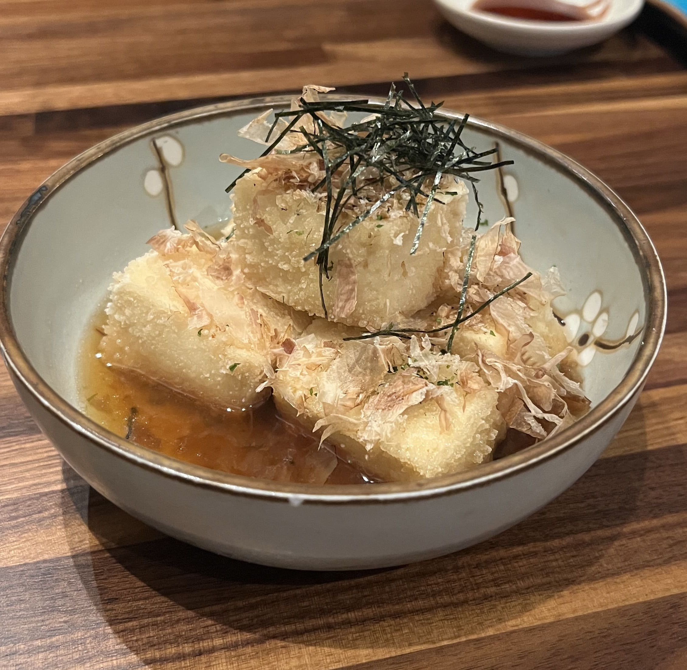
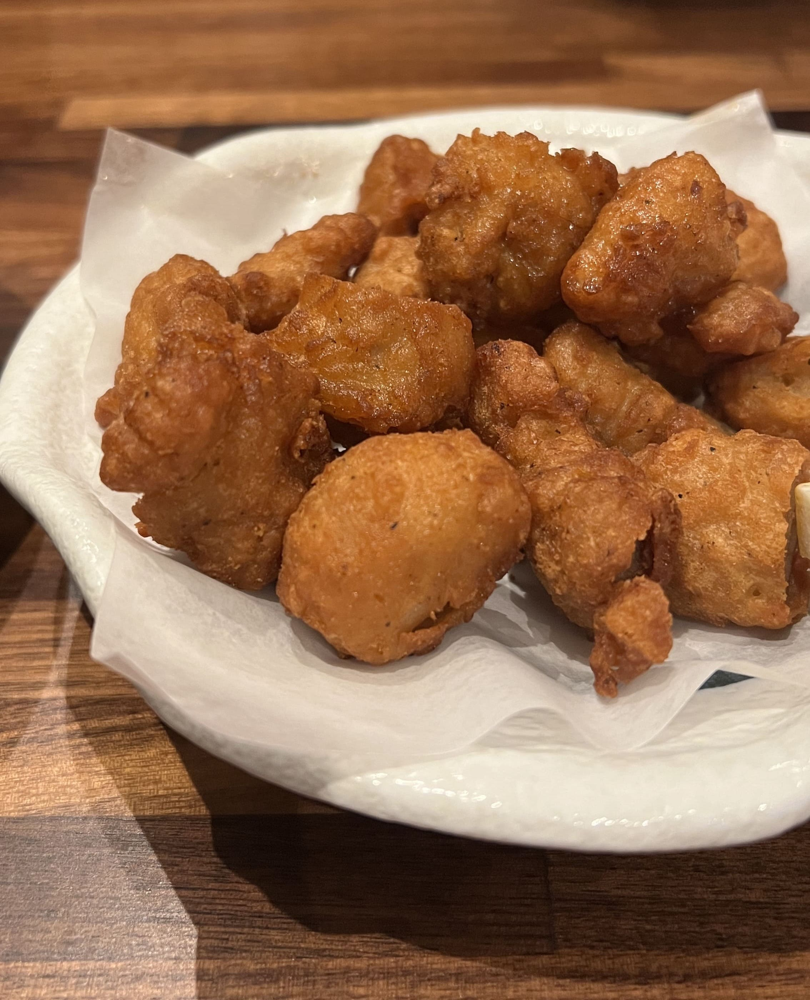

Yuyake DanDan is located on the upper level of the Stoneridge Shopping Center, with a parking lot-facing entrance featuring a Japanese-style gazebo and Hiragana characters carved on a large wooden sign. 

They have small cold appetizers such as oysters, ankimo, and beef tataki, as well as hot appetizers like karaage and agedashi tofu. The larger entree orders come as a set with salad, salmon sashimi, gyoza, edamame, and rice. You can also order omakase sets, or choose individual nigiri orders. They're probably most famous for their sashimi, which is served in an aesthetic grid wooden bento box - perfect for the gram, however I was (perhaps unluckily) craving nigiri today and decided to forgo the grid bento. Nonetheless, the nigiri was plenty aesthetic on its own:

    

I chose the o-toro (fatty tuna), tamago (egg), salmon belly, and unagi (eel). They were all delicious, and my favorite was probably the o-toro - it was flavorful and rich and I could taste the quality with every bite (it was the most expensive one). My least favorite out of the four (which is not saying much because I liked all of them) was the salmon belly, but that was more due to personal preferences. 

We also ordered agedashi tofu and chicken karaage as sides, which were both tasty as well. The chicken karaage was more lightly breaded than most karaage's I've had, and smaller (almost bite-sized), which I liked. 

    

 
 

    

The meal was on the pricier side (each pair of nigiri averaging about $9), but more or less what you'd expect from a high-quality Japanese restaurant that focuses on fresh sashimi and nigiri. I enjoyed it a lot, and would definitely come back for a special occasion meal. ☆ 

_tags: location/sfba, yuyake dan dan izakaya, stoneridge mall_